# Actividad 0.5: Prácticas Servidor Web Python

## Instalación de Python

Para instalar Python basta con descargarlo desde su página oficial: [python.org](https://www.python.org/downloads/).  
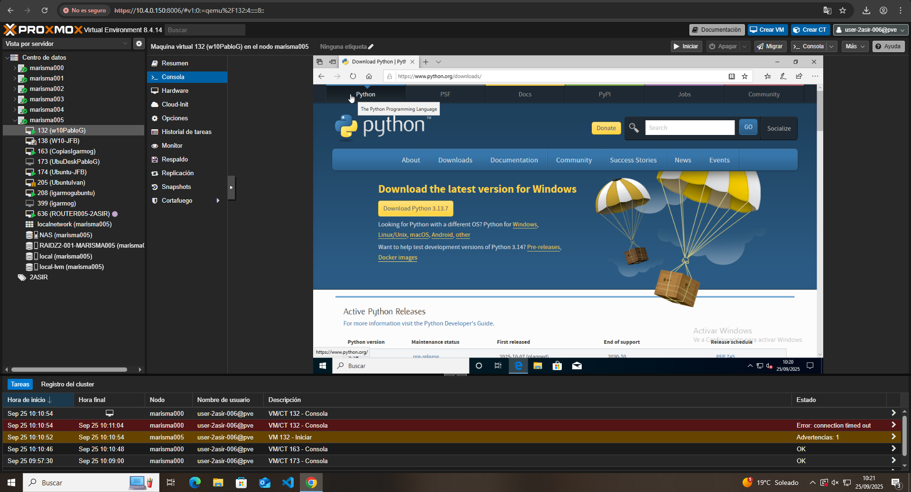

Una vez lo descargamos, procederemos a su instalación. Primero marcaremos la opción de **‘Install Now’**, lo que llevará a la instalación automática con los ajustes recomendados.  
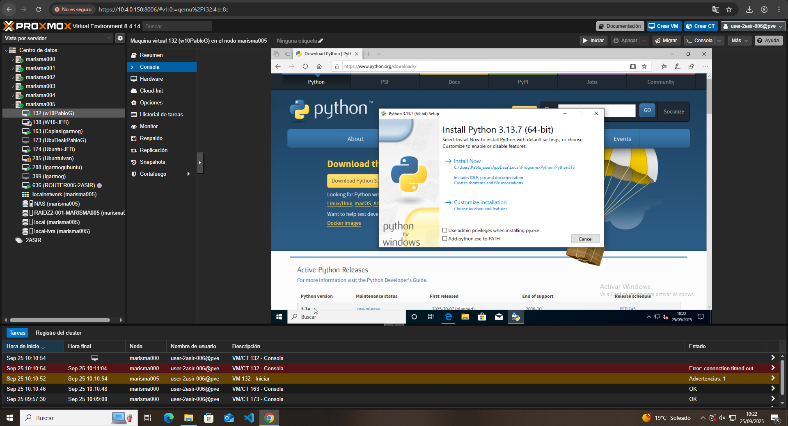

Después de esperar a que se termine la instalación, podremos cerrar la ventana pulsando **Close**.  
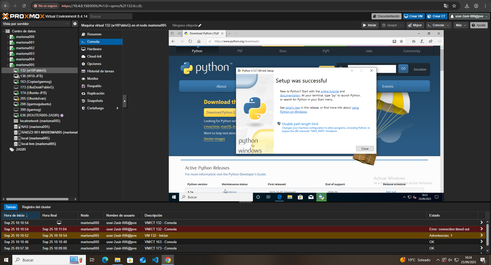

---

## Abrir Python en CMD

Para abrir Python basta con escribir 'python' en nuestro CMD.  
Para salir del intérprete y volver a la terminal normal, simplemente escribimos 'exit()'.  

Para hacer un servidor personal bastan con poner **python -m http.server 8000**.
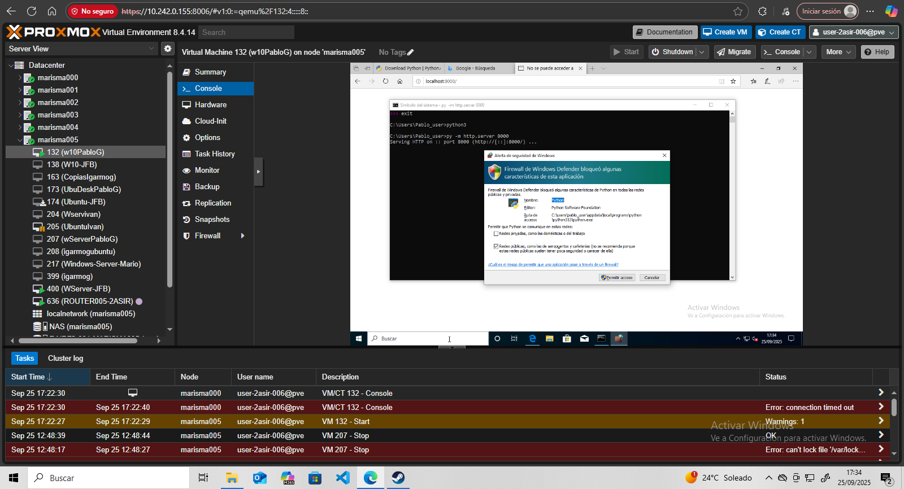
Ahora, con **localhost:8000** aparece la siguiente página:
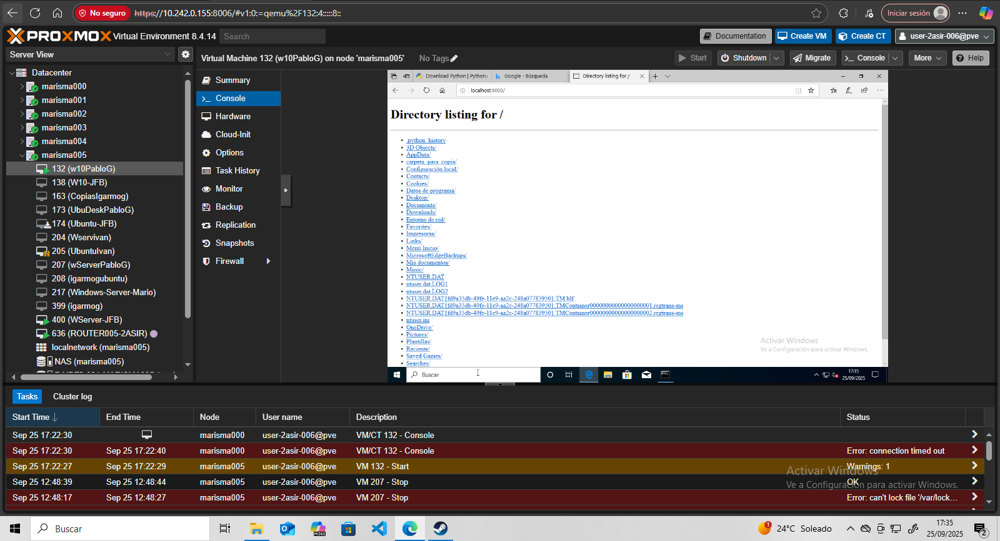
Como no tengo ninguna página, ha aparecido el listado de archivos.

---

## Crear un servidor HTTP

Para hacer un http server primero debemos crear un archivo: **notepad server.py** será el mío.
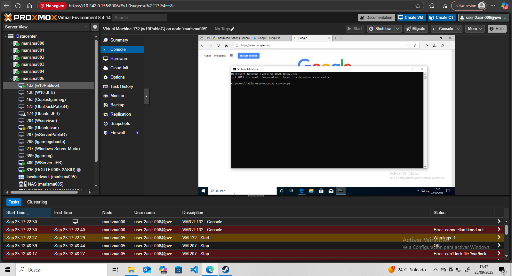

La primera vez que se crea un archivo saldrá un mensaje de si queremos crear dicho archivo, simplemente le damos a 'Sí'
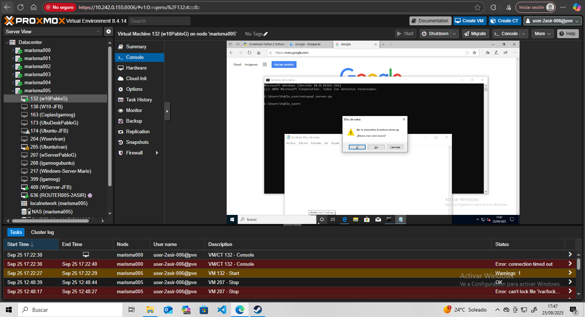

El contenido de mi archivo:
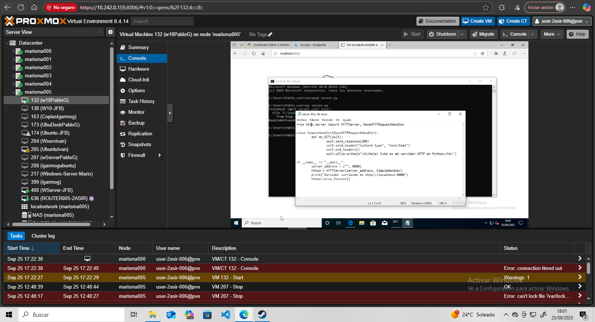

Reinicio mi localhost y ahora aparece el nuevo contenido de mi página:
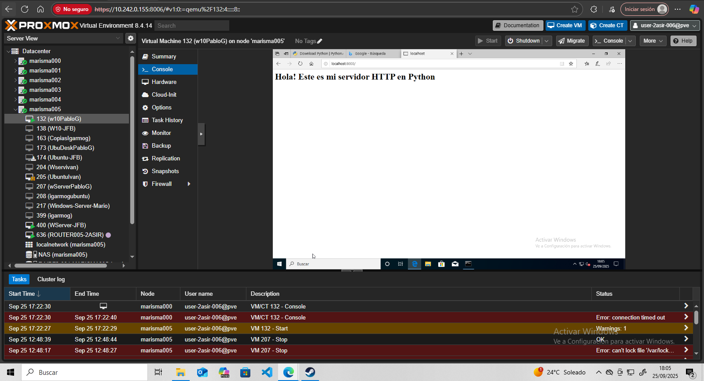

## Crear un dummy server

Para el dummy server el proceso es el mismo:
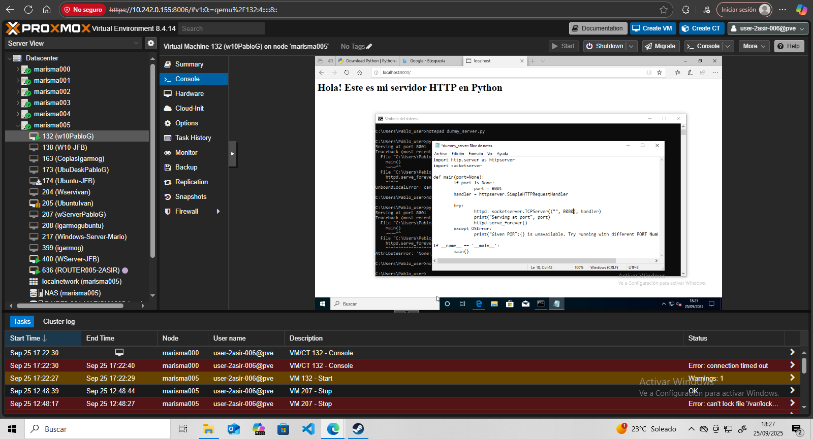
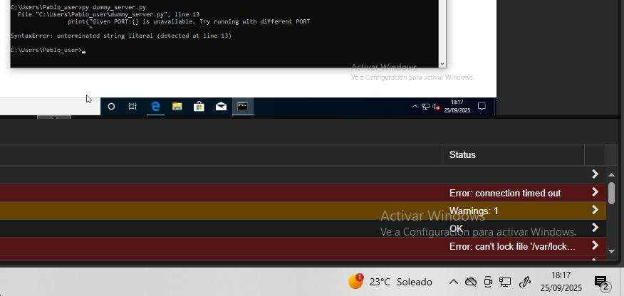

