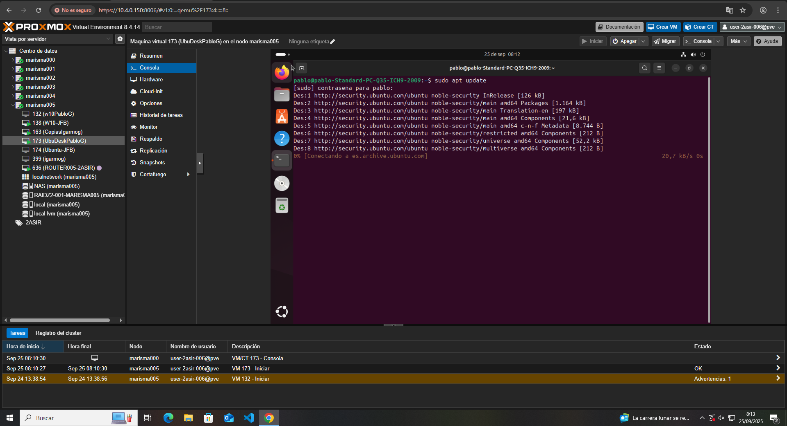
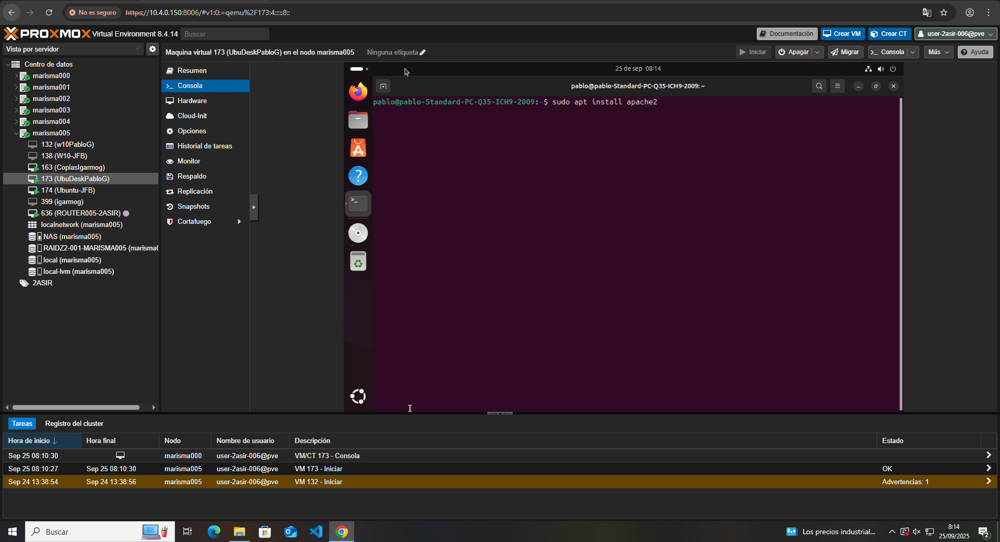
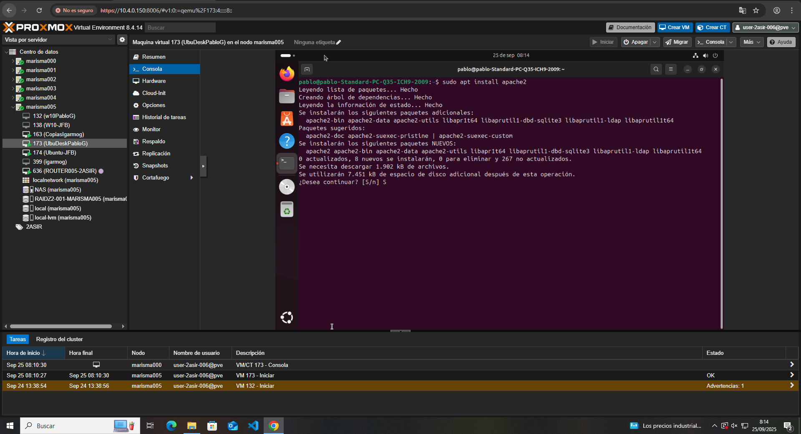
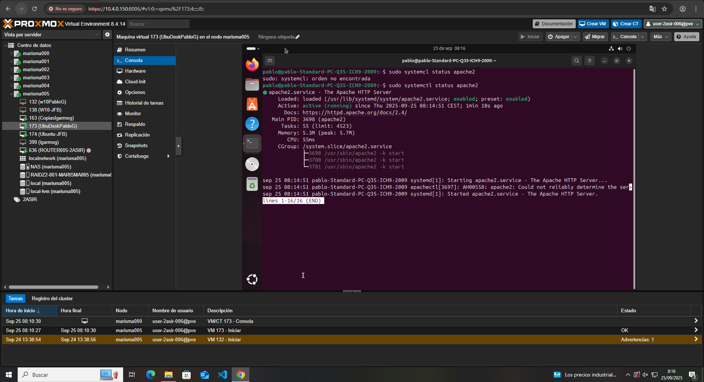
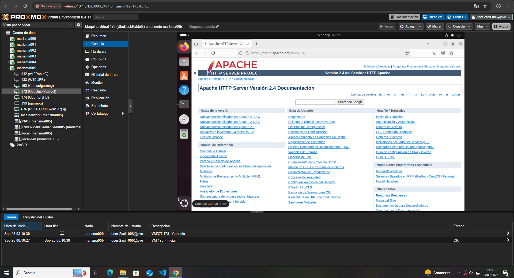
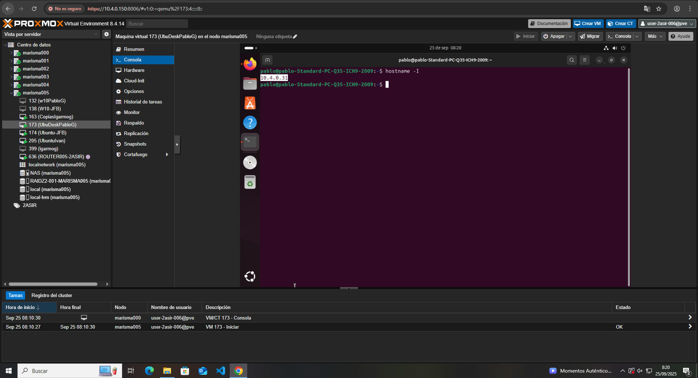
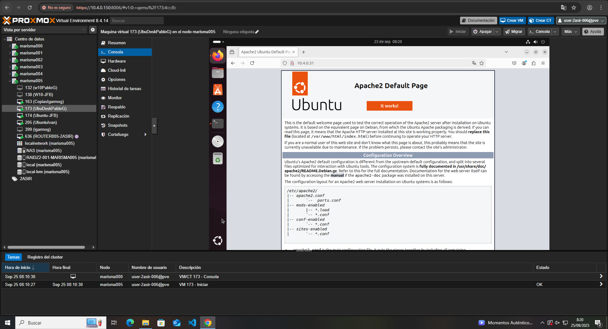
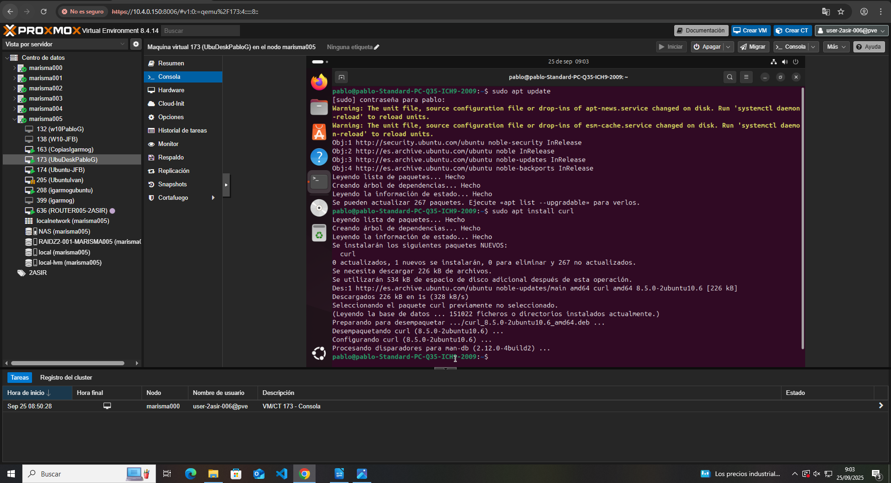
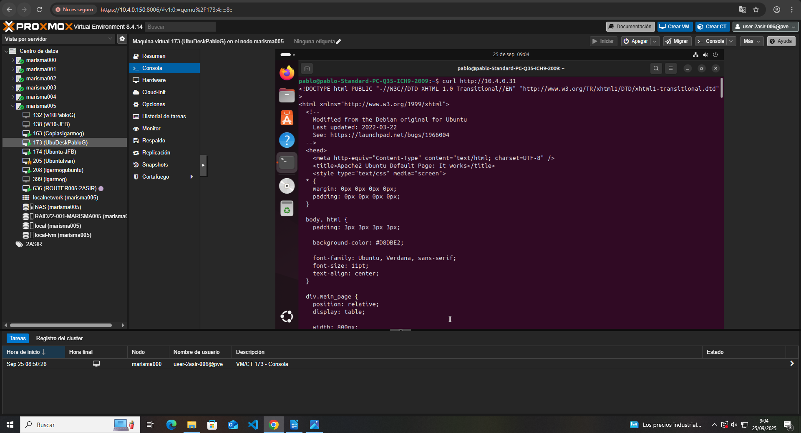

# Instalación de Apache en Ubuntu

## 1. Instalación de Apache  

Para instalar cualquier cosa en Ubuntu, primero es recomendable actualizar todo el sistema.  
Ejecuta el siguiente comando:
**sudo apt update**

Una vez se haya actualizado todo, procedemos a instalar Apache con:
**sudo apt install apache2**

Durante la instalación, le deberemos de dar que **Sí (S)** para proceder con la instalación.

## 2. Comprobar si Apache está instalado correctamente 

Si queremos comprobar que está instalado correctamente podemos hacer:
**sudo systemctl status apache2**
Nos debería de salir algo como esto:

Si hacemos clic en el enlace del apartado **Docs** nos llevará a la siguiente página: 

Esta página es el **Apache HTTP Server Website Project**, donde podremos ver las versiones de Apache, sus actualizaciones, manuales, etc. 

## 3. Apache server personal

Para conectarnos a nuestro servidor de Apache, primero debemos conocer nuestra IP, la forma más fácil de hacer eso es con:
**hostname -I**

Mi IP es 10.4.0.31, por lo que si en un navegador escribo **http:10.4.0.31** debería de salirme mi página de Apache.

(esto también se puede hacer con curl://[dirección], donde te mostrará tu página pero en línea de comandos)
Primero, volvemos a hacer **sudo apt update** y luego **sudo apt install curl**

