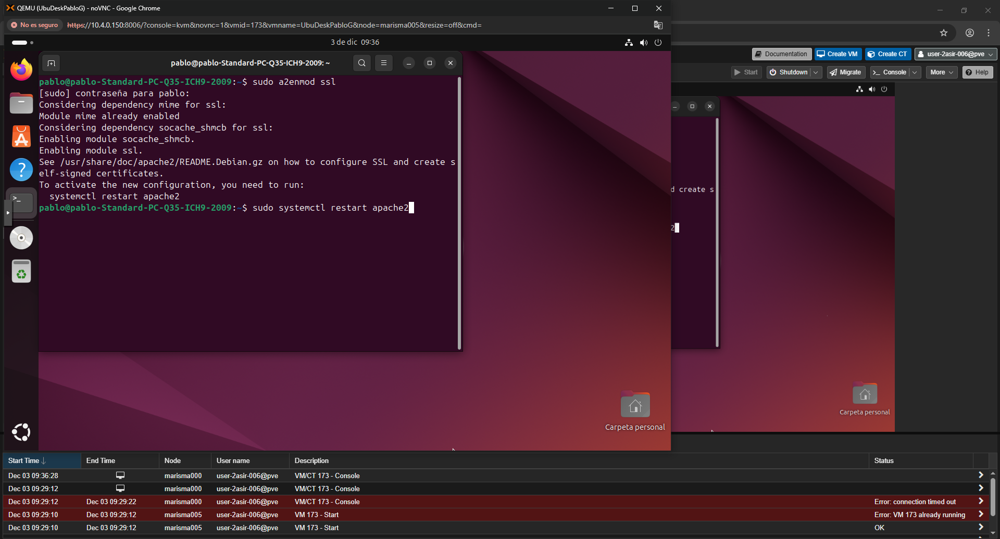
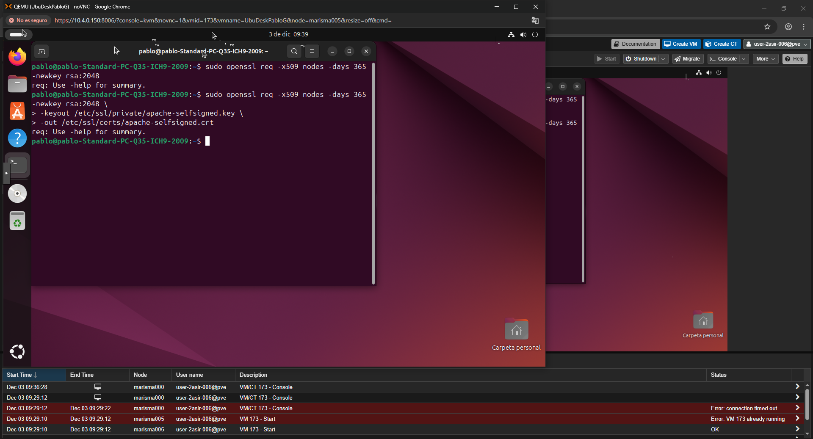
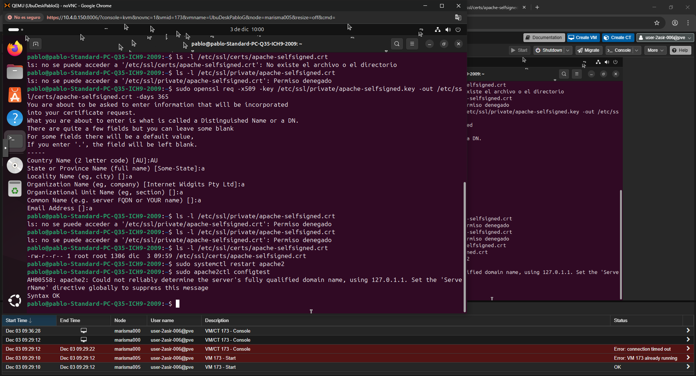
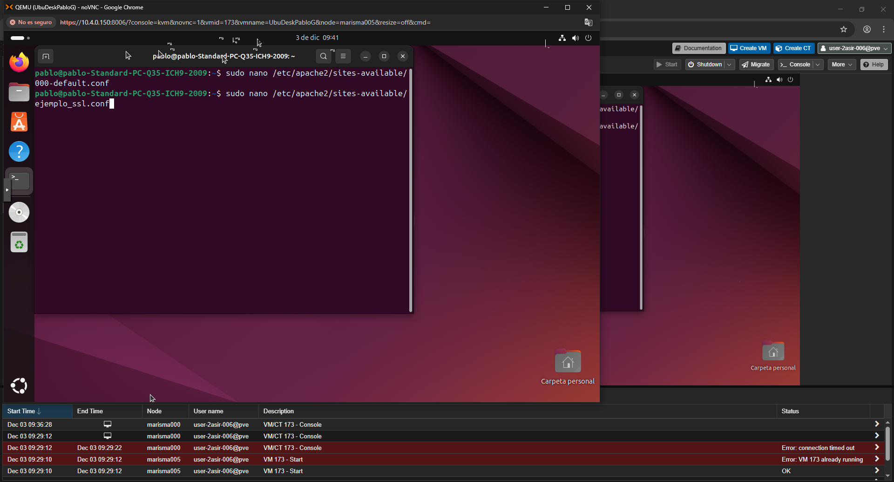
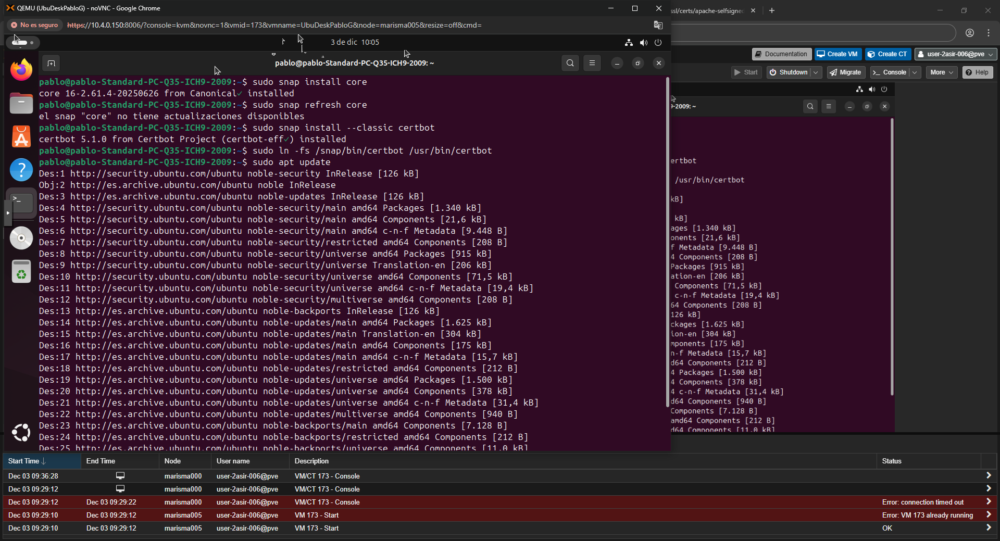
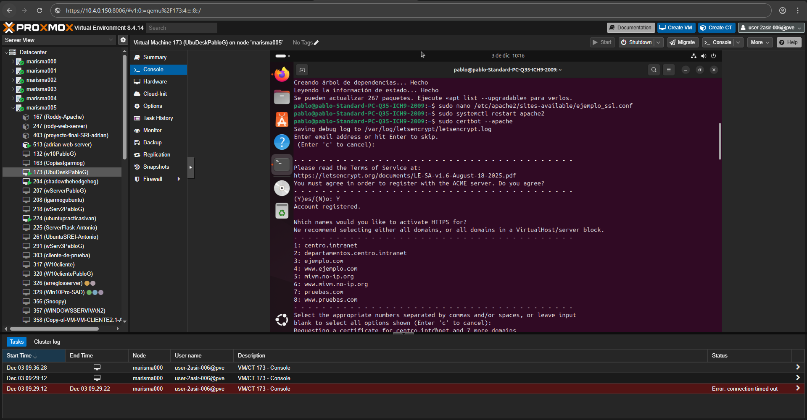
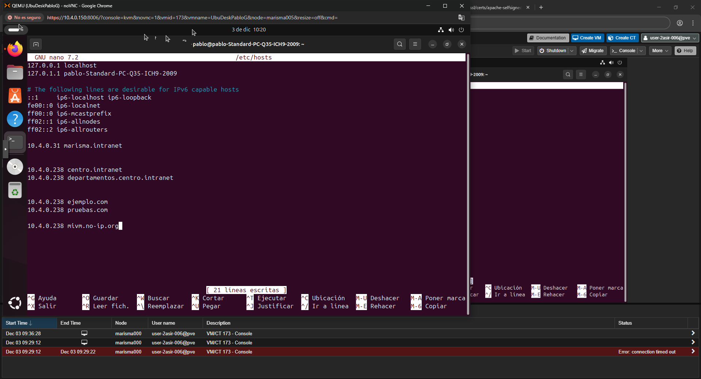

# PRÁCTICA: CONFIGURACIÓN APACHE SSL

## 1. Instalar OpenSSL
sudo a2enmod ssl
sudo systemctl restart apache2

## 2. Crear certificado autofirmado (válido 365 días)
    sudo openssl req -x509 -key /etc/ssl/private/apache-selfsigned.key \
    -out /etc/ssl/certs/apache-selfsigned.crt -days 365 \
    -subj "/C=ES/ST=Estado/L=Ciudad/O=MiOrganizacion/CN=mivm.no-ip.org"

## 3. Crear VirtualHost SSL
sudo tee /etc/apache2/sites-available/mivm-ssl.conf > /dev/null <<EOL

    <VirtualHost *:443>
    ServerName mivm.no-ip.org
    ServerAlias www.mivm.no-ip.org
    DocumentRoot /var/www/html

    SSLEngine on
    SSLCertificateFile /etc/ssl/certs/apache-selfsigned.crt
    SSLCertificateKeyFile /etc/ssl/private/apache-selfsigned.key

    <Directory /var/www/html>
        Require all granted
    </Directory>
    </VirtualHost>

    <VirtualHost *:80>
    ServerName mivm.no-ip.org
    ServerAlias www.mivm.no-ip.org
    DocumentRoot /var/www/html

    # Redirige HTTP a HTTPS
    RewriteEngine On
    RewriteRule ^(.*)$ https://%{HTTP_HOST}$1 [R=301,L]
    </VirtualHost>
    

## 4. Instalar Certbot

## 5. Configurar /etc/hosts para pruebas locales
Edita /etc/hosts en la VM o en tu máquina cliente y añade:
10.4.0.238   mivm.no-ip.org

