# Tema 1 Acts 2.2

## 1. Script que añada un puerto de escucha en el fichero de configuración de Apache.

Iniciamos apache (sudo systemctl start apache2) y escribimos lo siguiente para crear el script:

**nano ~/add_apache_port.sh** (add_apache_port es el nombre de mi script)
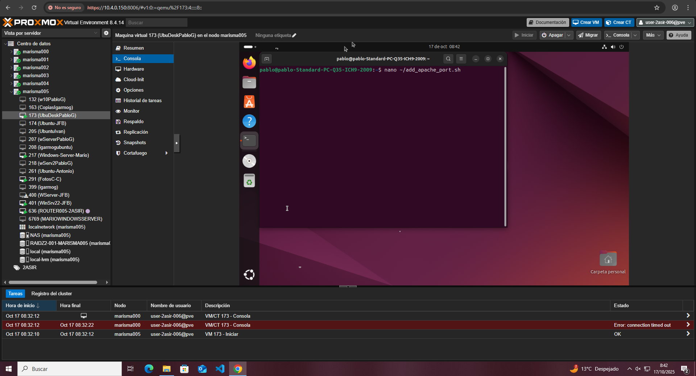

Dentro, escribimos el contenido de nuestro script.
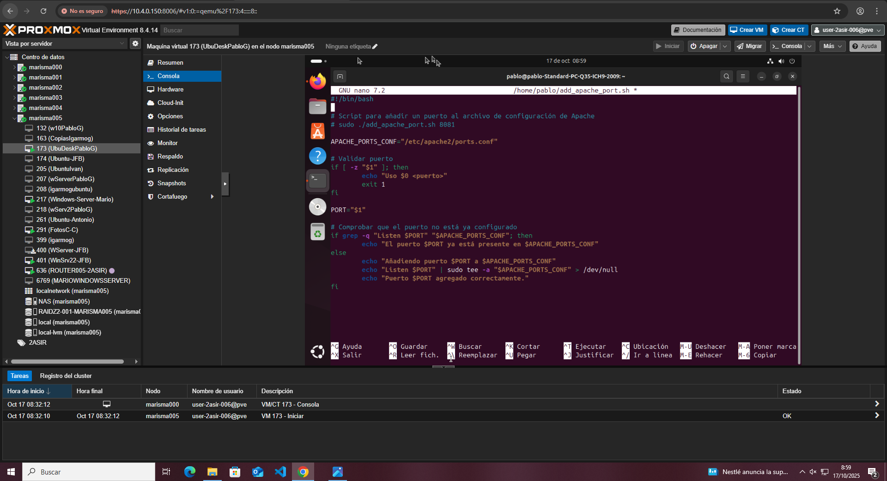

Una vez terminado, lo guardamos, cerramos y procedemos a reiniciar apache2 para que se actualicen los cambios.
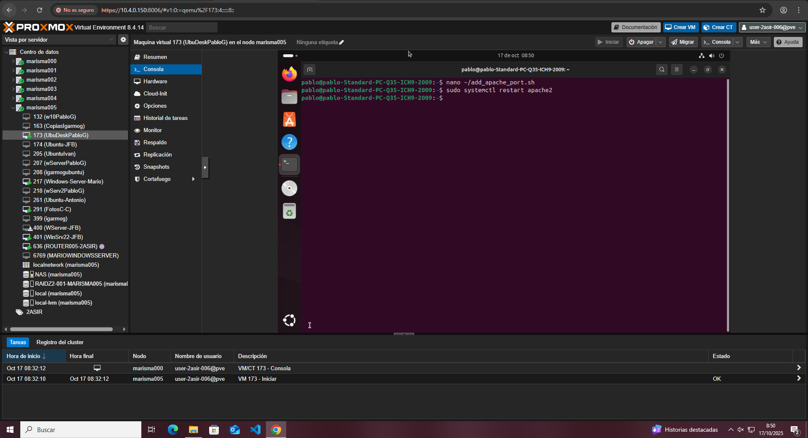

A continuación, hacemos que el script que hemos creado sea ejecutable con:

**chmod +x ~/add_apache_port.sh**
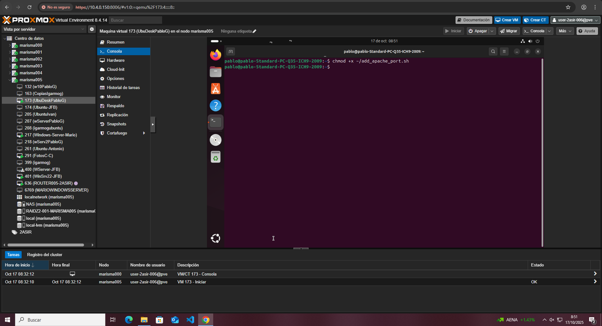

Para ejecutar el script en un puerto, escribimos:

**sudo ~/add_apache_port.sh 8082**
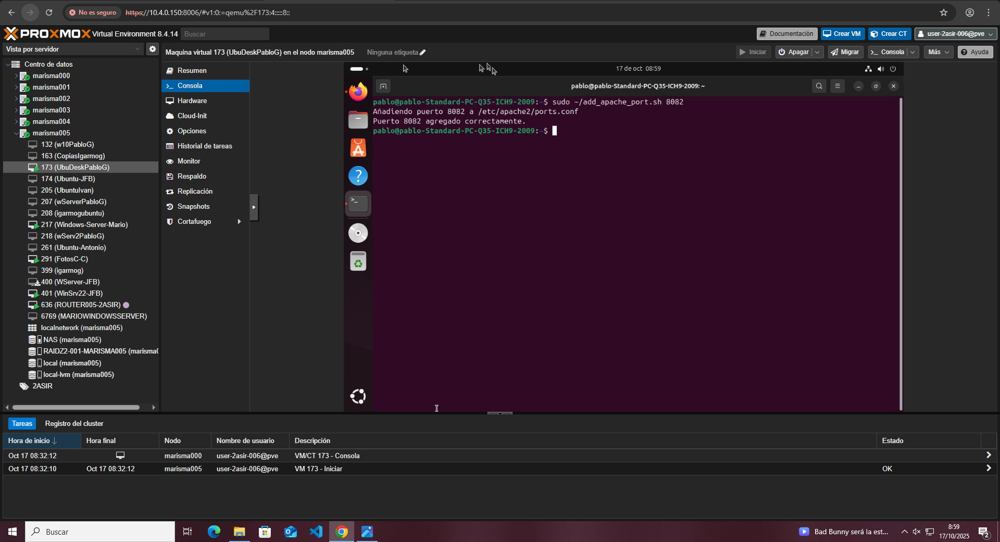

Si intentamos ejecutar en un puerto activa, nos saldrá el siguiente mensaje:
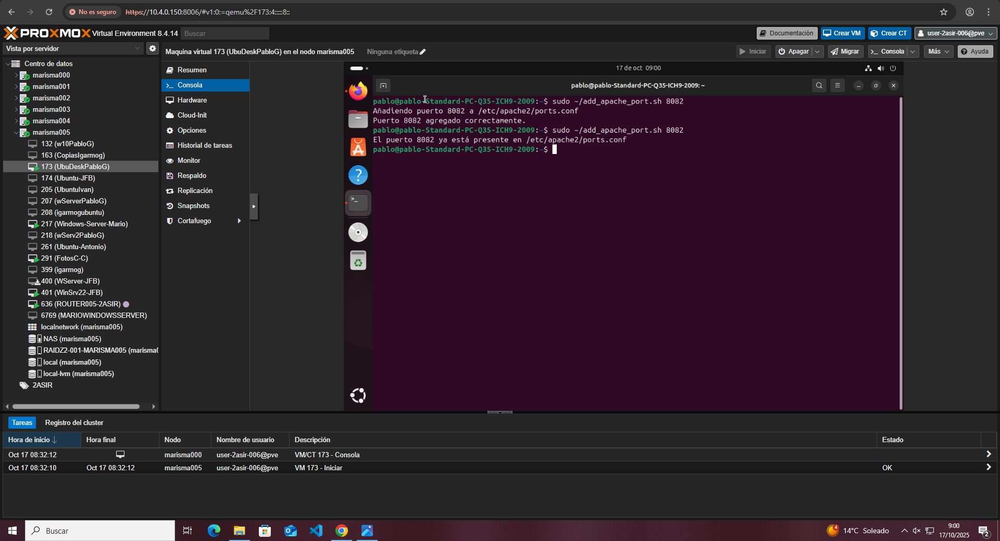

## 2. Script que añada un nombre de dominio y una ip al fichero hosts.

Creamos el nuevo script:

**nano ~/add_entry_host.sh** (add_entry_host es el nombre de mi script)
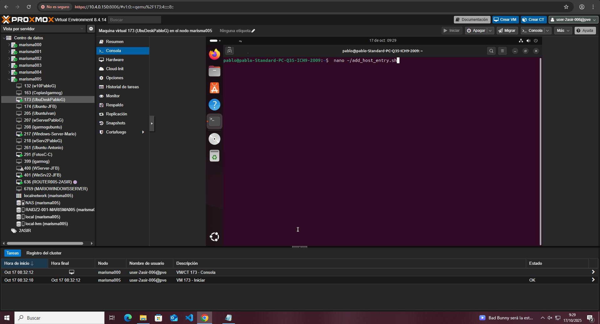

Dentro, escribimos el contenido de nuestro script.
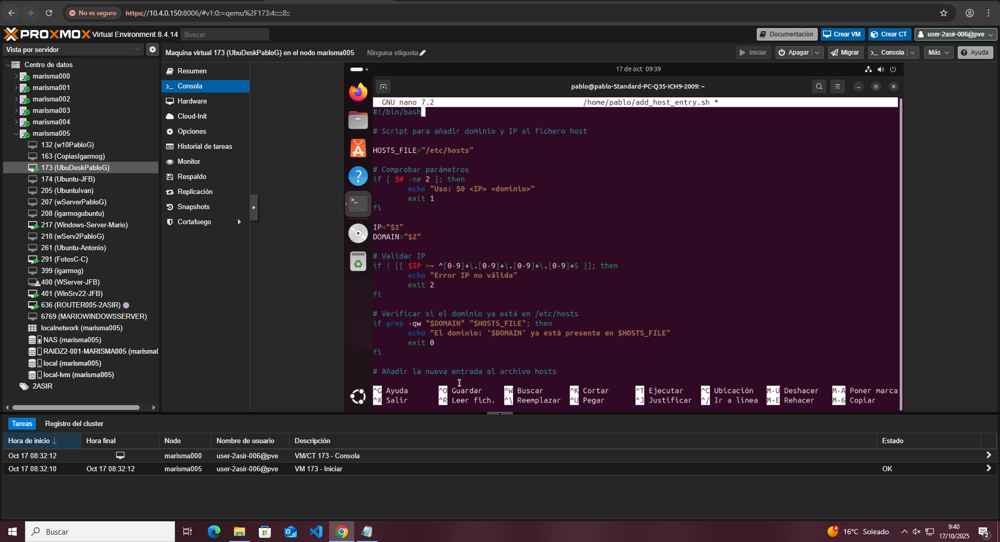
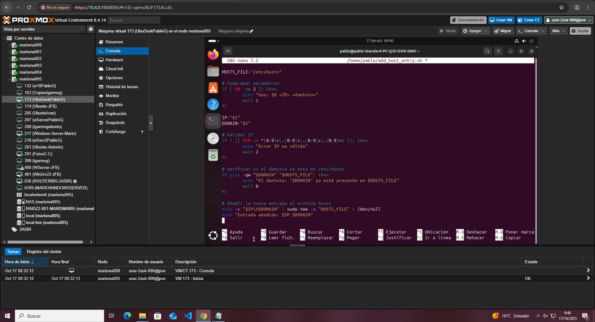

Una vez terminamos, lo guardamos, cerramos y procedemos a reiniciar apache2 para que se actualicen los cambios.
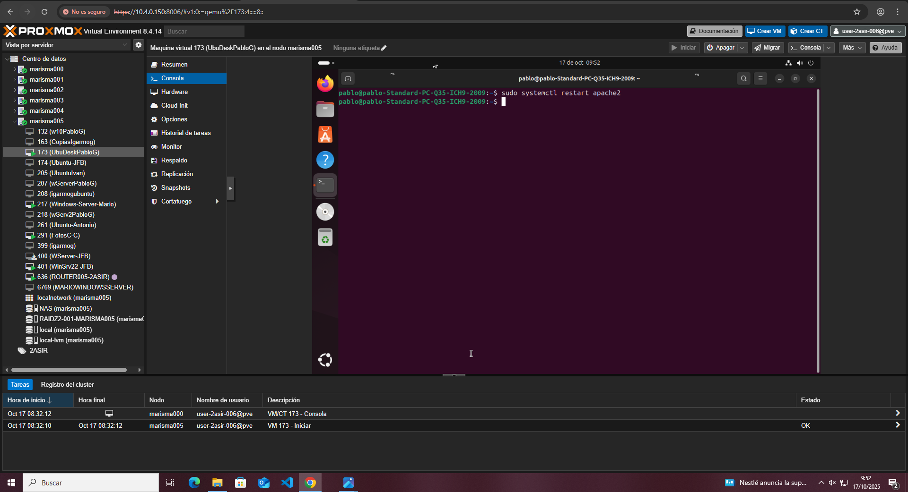

A continuación, hacemos que el script que hemos creado sea ejecutable con:

**chmod +x add_entry_host.sh**

Finalmente, ejecutamos el script:

**sudo ./add_host_entry.sh 10.4.0.31 miejemplo** (miejemplo es el nombre con el que lo ejecuto, la IP se puede obtener usando hostname -I)
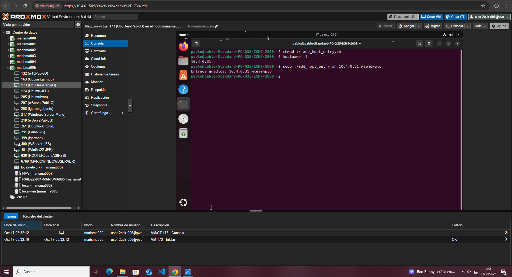

## 3. Script que nos permita crear una página web con un título, una cabecera y un mensaje

Creamos el nuevo script:

**nano ~/create_webpage.sh** (create_webpage es el nombre de mi script)
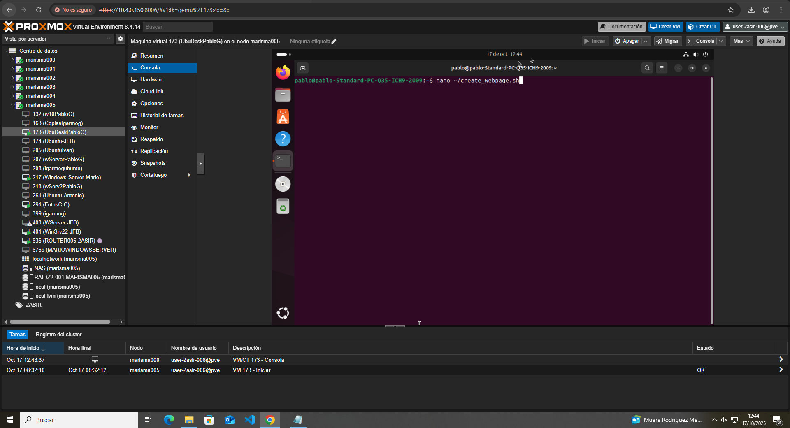

Dentro, escribimos el contenido de nuestro script.
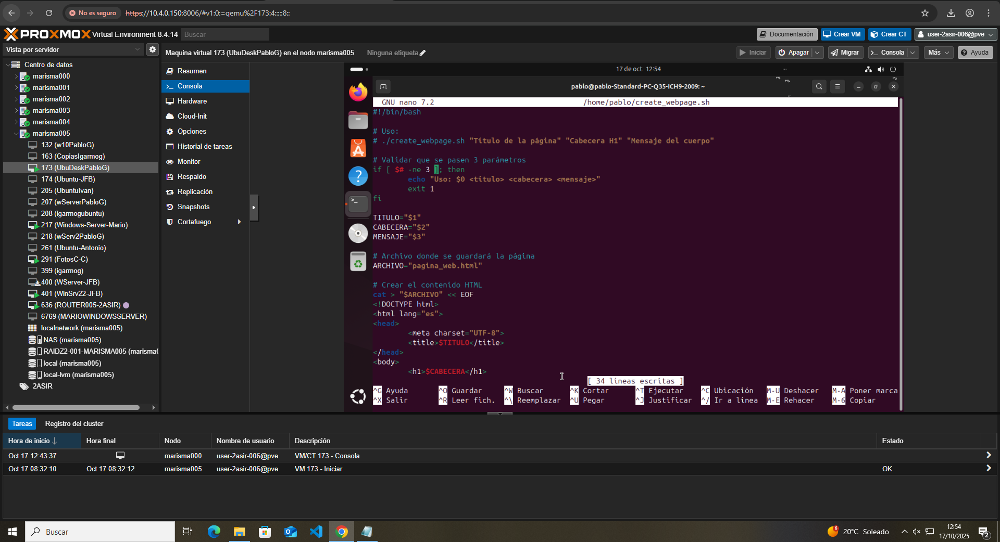
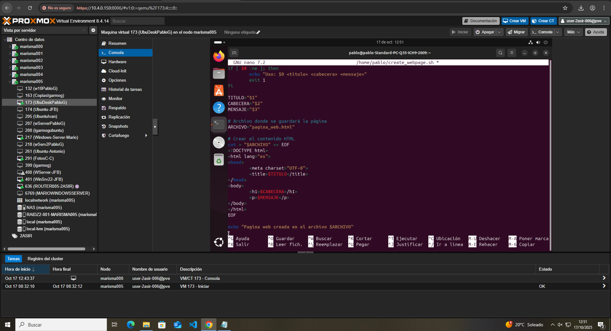

Una vez terminamos, lo guardamos, cerramos y procedemos a reiniciar apache2 para que se actualicen los cambios.
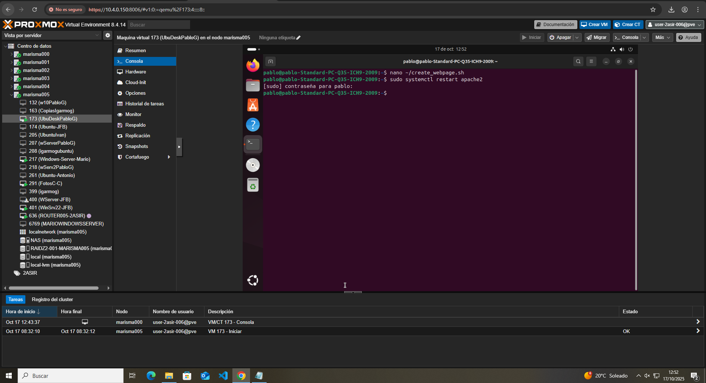

A continuación, hacemos que el script que hemos creado sea ejecutable con:

**chmod +x create_webpage.sh**
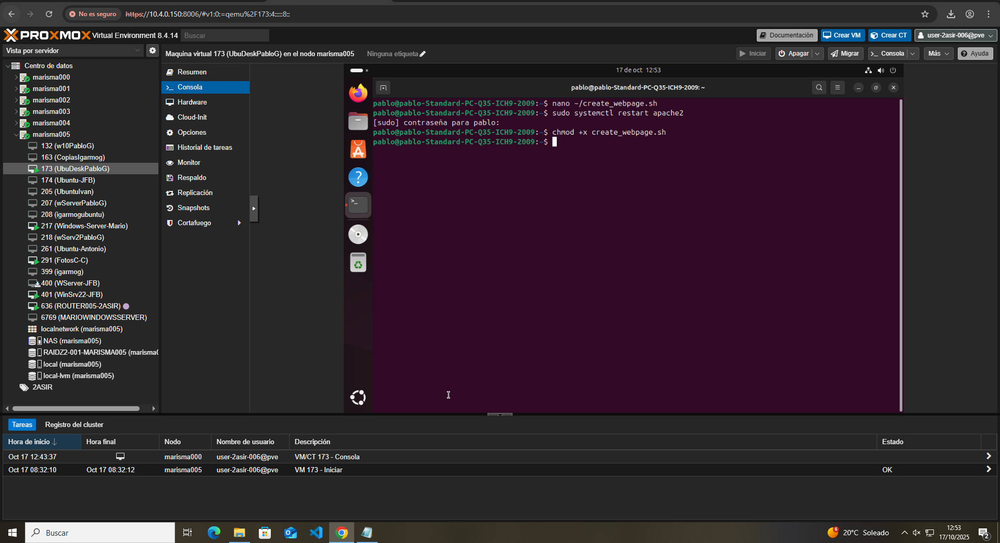

Finalmente, ejecutamos el script:

**./create_webpage.sh "Mi sitio web" "Bienvenidos" "Esta es una web creada con un script"**
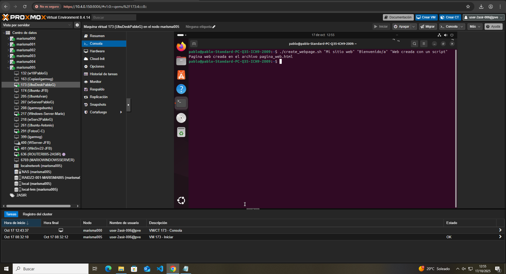

Si todo sale bien, se creará un archivo 'pagina_web.html' en nuestra carpeta actual.
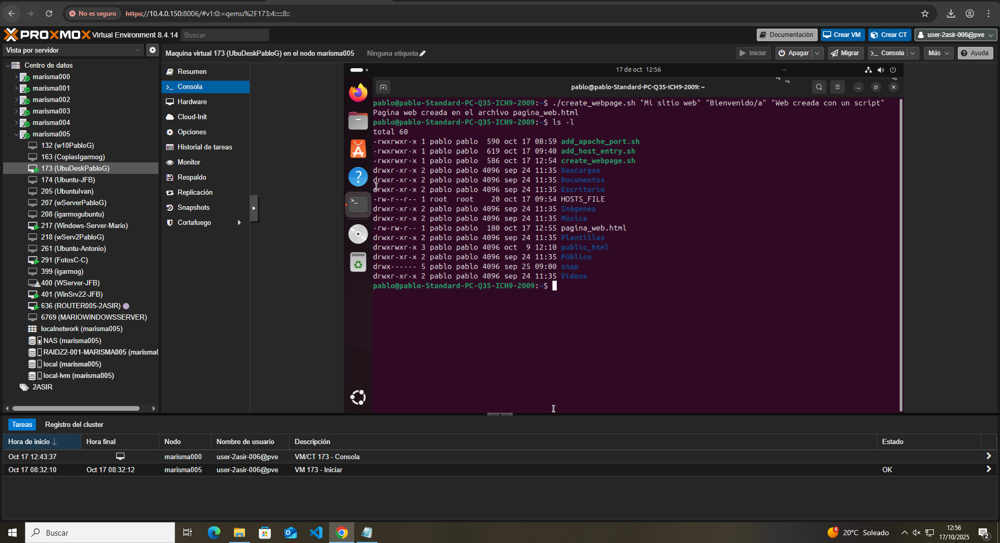
Podemos abrirla en nuestor navegador con:
firefox pagina_web.html
xdg-open pagina_web.html
También puedes buscar 'pagina_web.html' con el explorador de archivos y hacer doble clic en el archivo
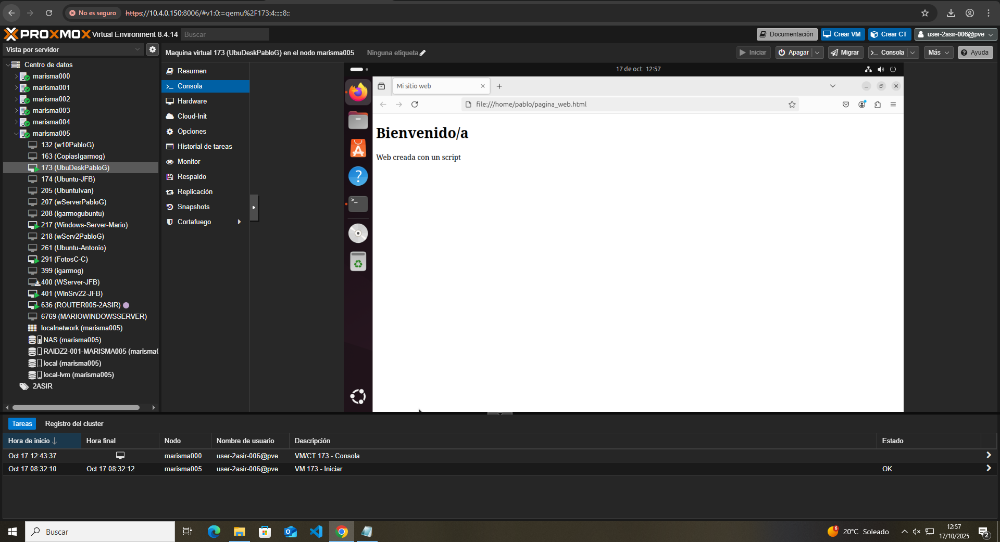
