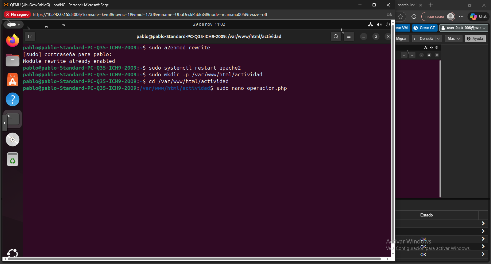
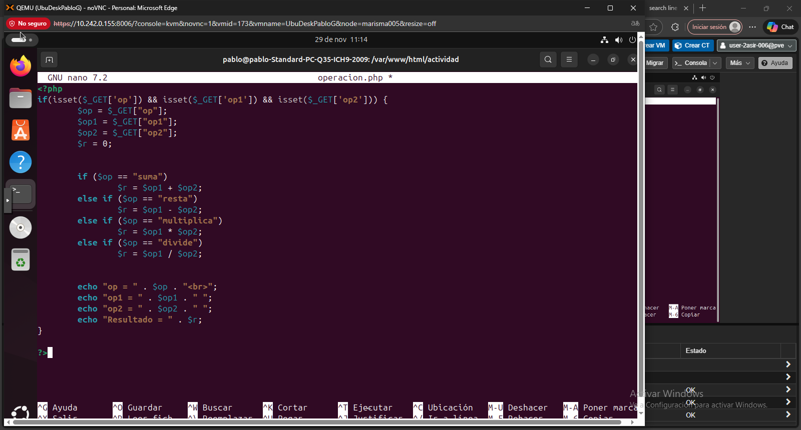
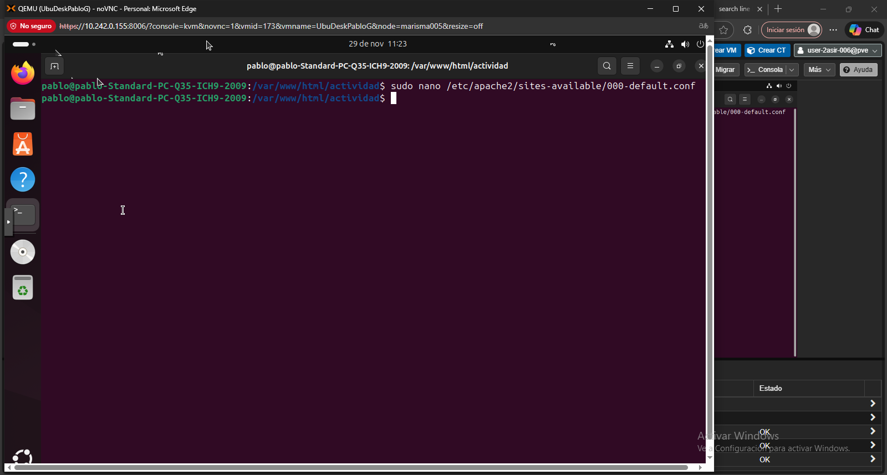
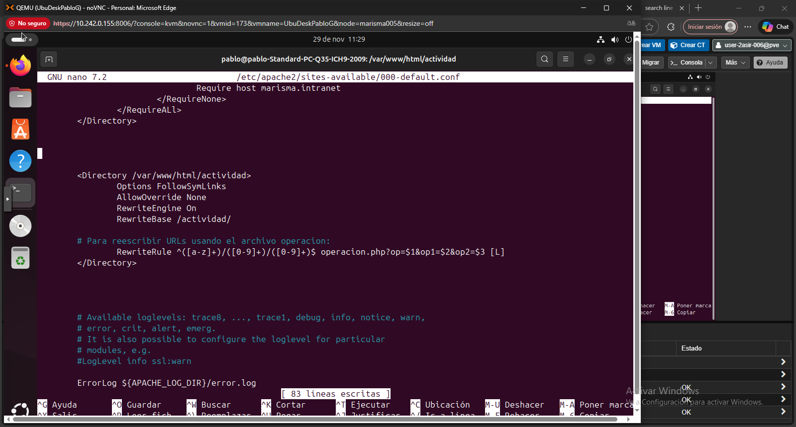
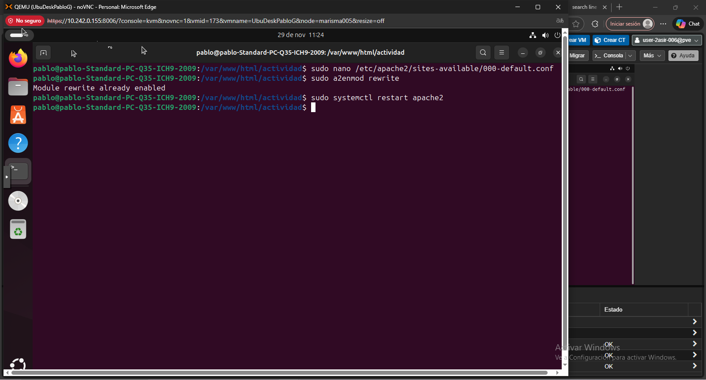
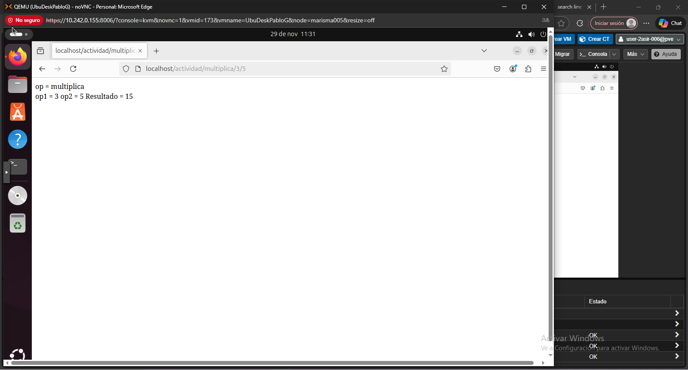

# Reescritura de URLs con Apache y PHP

## 1. Crear la directiva y el archivo .php
Es importante comrpobar que **mod_rewrite** esté activado, ya que es el que se encargan de transformar URLs legibles en parámetros GET que son procesados por PHP

Su contenido:

---

## 2. Configuración de Apache sin .htaccess

Editamos **/etc/apache2/sites-available/000-default.conf**:

### RewriteEngine On -> activa el módulo de reescritura.   
### RewriteBase /actividad/ -> establece la base de la URL que se va a reescribir.   
### RewriteRule ^([a-z]+)/([0-9]+)/([0-9]+)$ ... -> captura la operación y dos números de la URL y los pasa como parámetros GET a operacion.php.   
### [L] -> indica que si coincide esta regla, no se aplicarán más reglas.   

---

## 4. Reiniciar Apache
**sudo systemctl restart apache2**

---

## 5. Comprobación de que funciona correctamente

**http://localhost/actividad/suma/3/5**

**http://localhost/actividad/resta/3/5**

**http://localhost/actividad/multiplica/3/5**

**http://localhost/actividad/divide/3/5**

Apache convierte estas URLs en llamadas a **operacion.php?op=suma&op1=3&op2=5**, etc., mostrando el resultado de la operación.

