# Pre-Requisitos
Antes de empezar este tutorial, deberías crear un usuario no-root siguiendo los pasos del 1 al 4 en esa guía.

Además necesitas tener instalado Apache para poder continuar los siguientes pasos. Si no lo has hecho aún, puedes instalar Apache en tu servidor mediante apt-get:

```bash
sudo apt-get update
sudo apt-get install apache2
```

Después de completar estos pasos, podemos empezar.

Para propósitos de esta guía, mi configuración creará un virtual host para **ejemplo.com** y otro para **pruebas.com**. Se hará referencia a ellos en esta guía, pero tú deberías sustituirlos por tus propios dominios durante el proceso.

# 1. Crear la Estructura del Directorio
El primer paso que necesitamos es crear la estructura de directorios que mantendrán la información de nuestro sitio.

```bash
sudo mkdir -p /var/www/ejemplo.com/public_html
sudo mkdir -p /var/www/pruebas.com/public_html
```
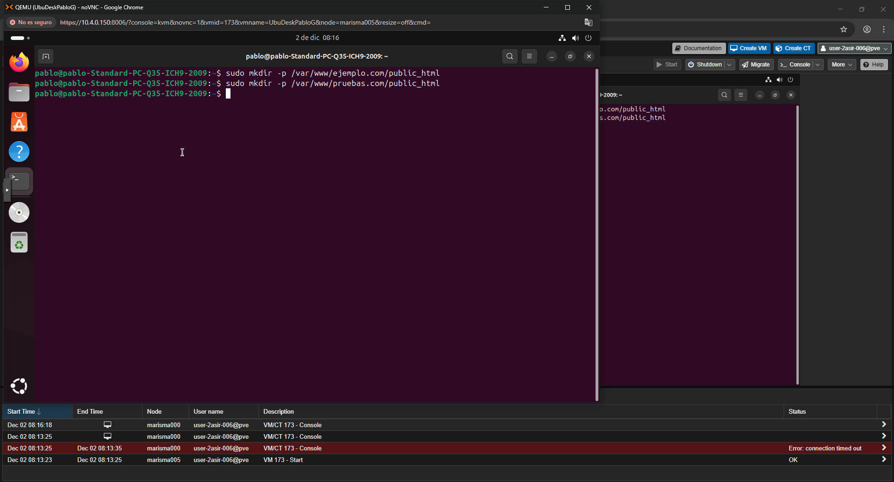


# 2. Otorgar Permisos
```bash
sudo chown -R $USER:$USER /var/www/ejemplo.com/public_html
sudo chown -R $USER:$USER /var/www/pruebas.com/public_html
sudo chmod -R 755 /var/www
```

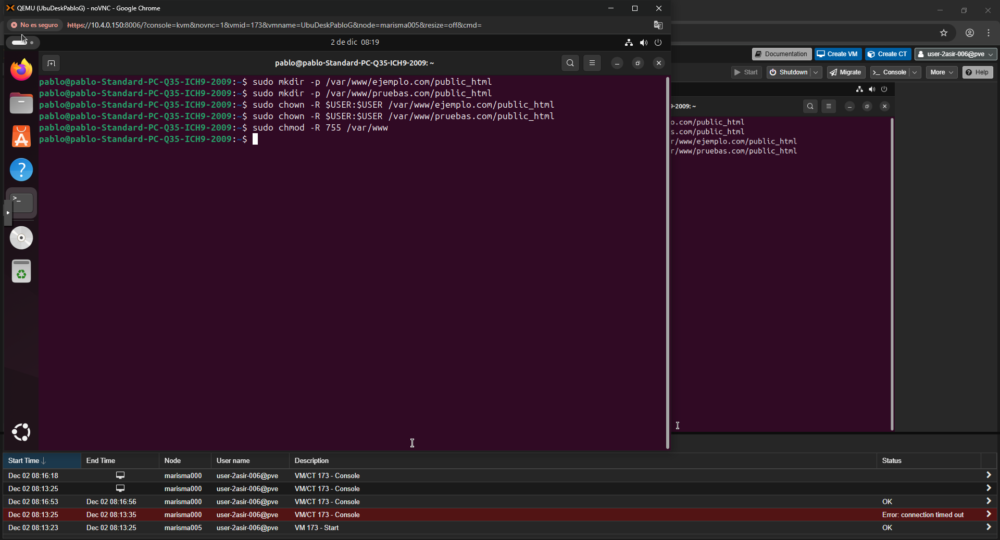

# 3. Crear una Página de Prueba
Editar el archivo:

```bash
nano /var/www/ejemplo.com/public_html/index.html
```
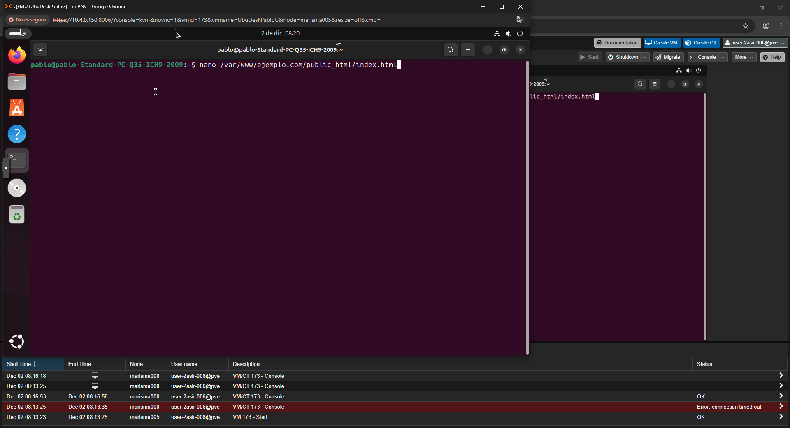

Contenido ejemplo:

```html
<html>
  <head>
    <title>Bienvenido a Ejemplo.com!</title>
  </head>
  <body>
    <h1>Éxito! El Virtual Host ejemplo.com esta funcionando!</h1>
  </body>
</html>
```
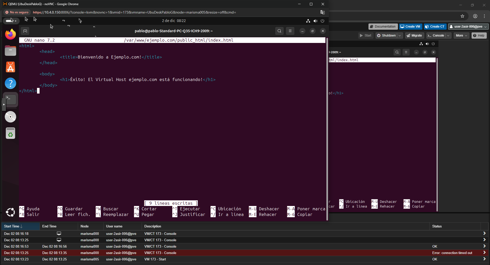

Copiar para el segundo sitio:

```bash
cp /var/www/ejemplo.com/public_html/index.html /var/www/pruebas.com/public_html/index.html
nano /var/www/pruebas.com/public_html/index.html
```
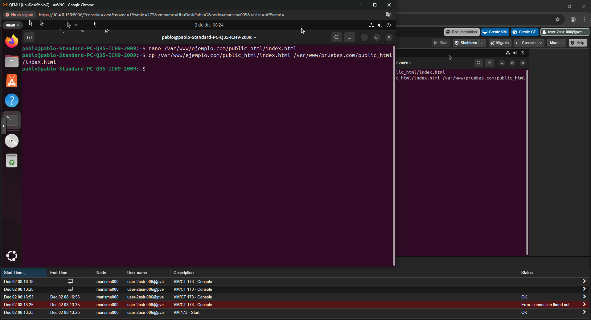

Modificar a:

```html
<html>
  <head>
    <title>Bienvenido a Pruebas.com!</title>
  </head>
  <body>
    <h1>Éxito! El Virtual Host pruebas.com esta funcionando!</h1>
  </body>
</html>
```
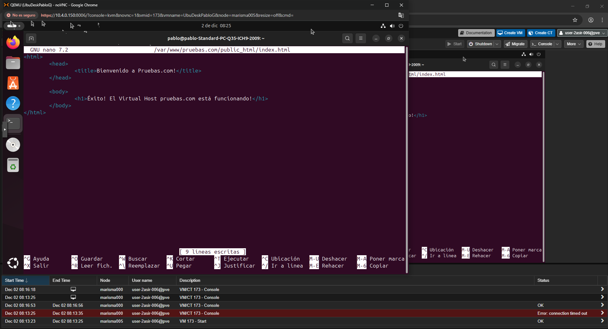

# 4. Crear Archivos Virtual Host
Copiar la plantilla:

```bash
sudo cp /etc/apache2/sites-available/000-default.conf /etc/apache2/sites-available/ejemplo.com.conf
sudo nano /etc/apache2/sites-available/ejemplo.com.conf
```
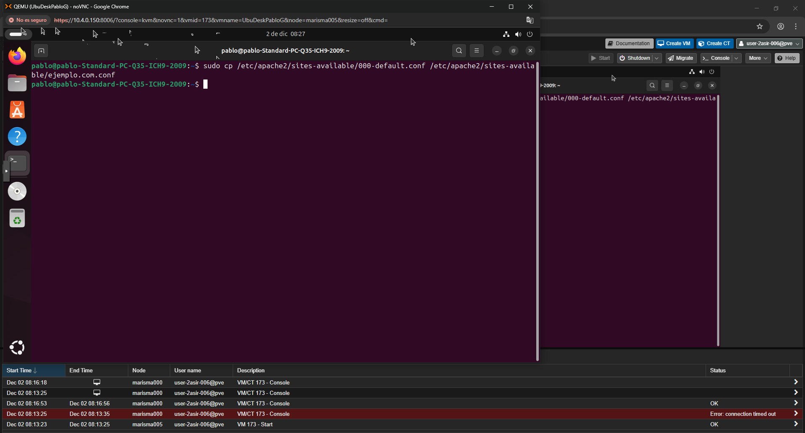
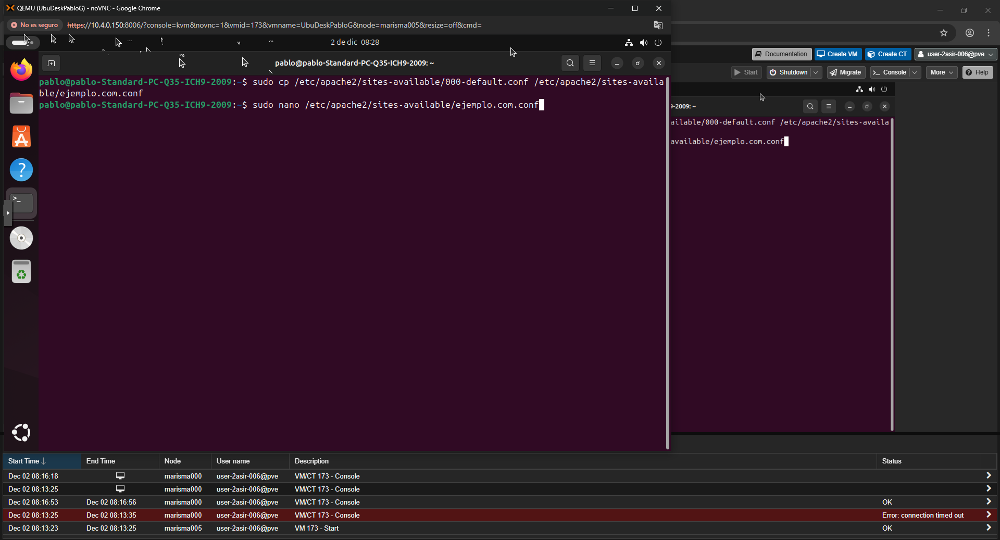
Contenido esperado:

```apache
<VirtualHost *:80>
    ServerAdmin admin@ejemplo.com
    ServerName ejemplo.com
    ServerAlias www.ejemplo.com
    DocumentRoot /var/www/ejemplo.com/public_html
    ErrorLog ${APACHE_LOG_DIR}/error.log
    CustomLog ${APACHE_LOG_DIR}/access.log combined
</VirtualHost>
```
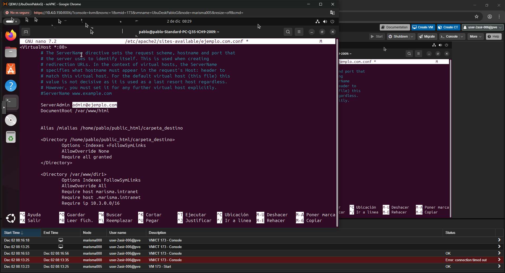
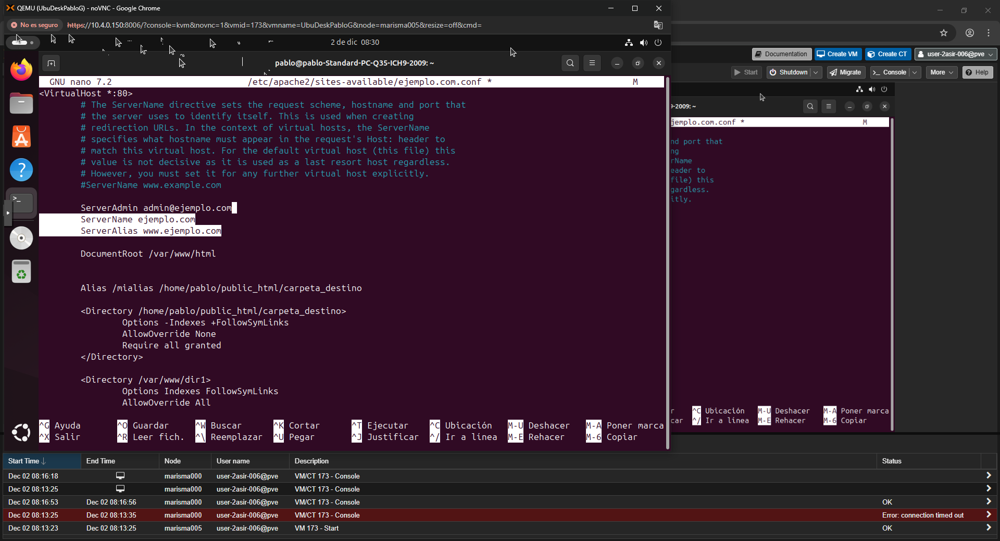
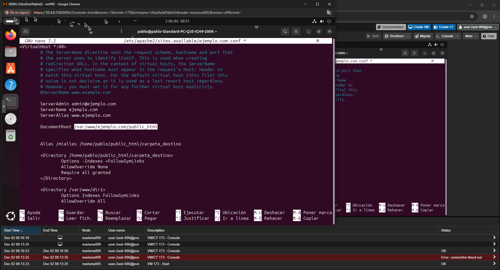

Copiar para el segundo dominio:

```bash
sudo cp /etc/apache2/sites-available/ejemplo.com.conf /etc/apache2/sites-available/pruebas.com.conf
sudo nano /etc/apache2/sites-available/pruebas.com.conf
```
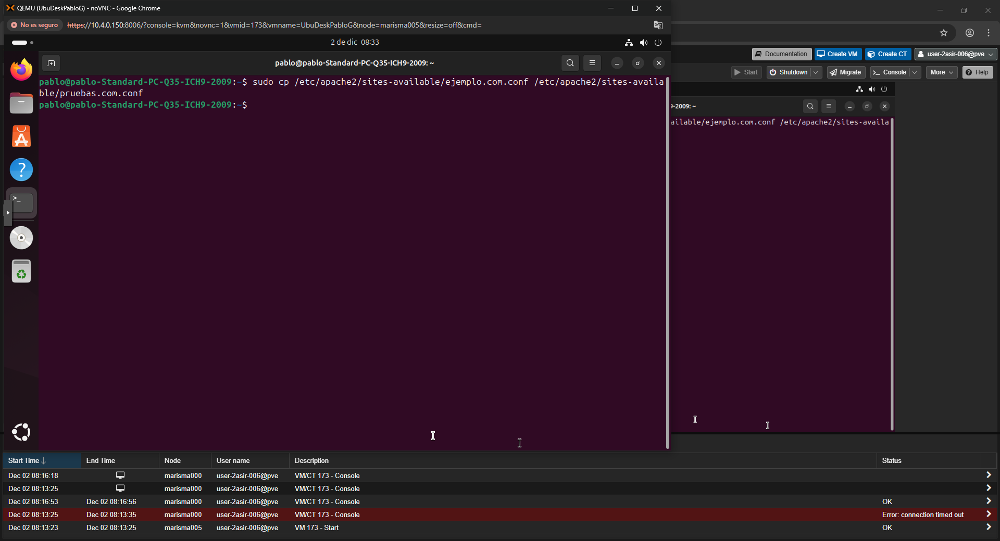
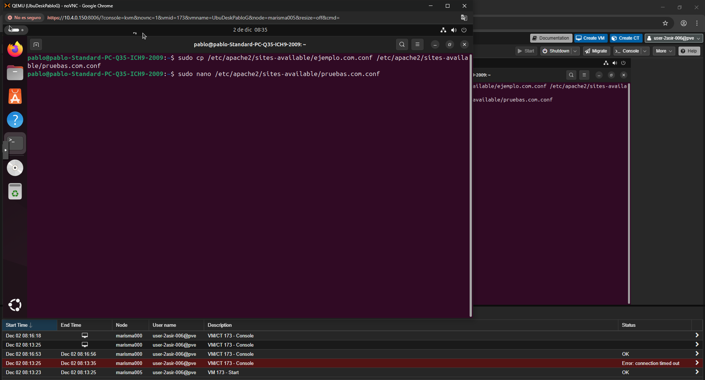

Modificar a:

```apache
<VirtualHost *:80>
    ServerAdmin admin@pruebas.com
    ServerName pruebas.com
    ServerAlias www.pruebas.com
    DocumentRoot /var/www/pruebas.com/public_html
    ErrorLog ${APACHE_LOG_DIR}/error.log
    CustomLog ${APACHE_LOG_DIR}/access.log combined
</VirtualHost>
```
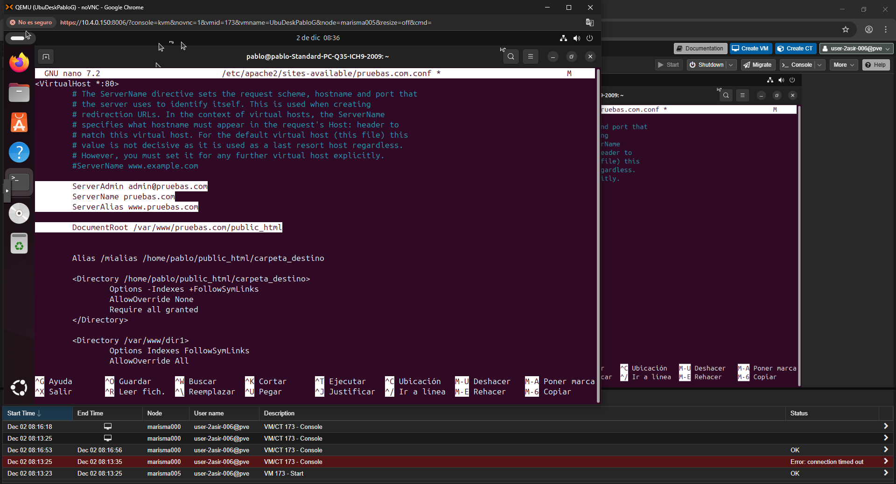

# 5. Habilitar los Virtual Hosts
```bash
sudo a2ensite ejemplo.com.conf
sudo a2ensite pruebas.com.conf
sudo service apache2 restart
```
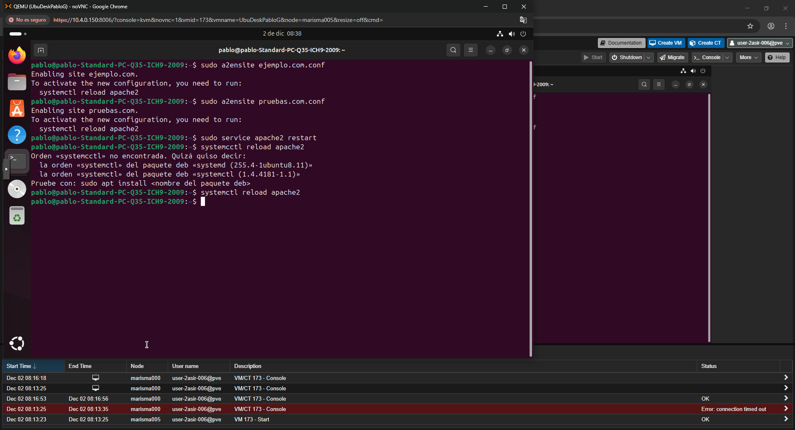

Es posible ver este mensaje (no afecta nada):

```
AH00558: apache2: Could not reliably determine the server's fully qualified domain name...
```

# 6. Configurar el archivo hosts local
En Linux/Mac:

```bash
sudo nano /etc/hosts
```

Agregar:

```
111.111.111.111 ejemplo.com
111.111.111.111 pruebas.com
```
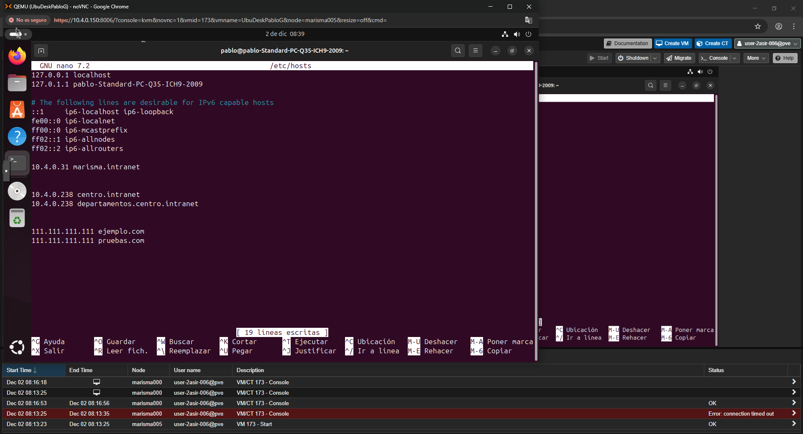

# 7. Comprobación
Visitar:

```
http://ejemplo.com
http://pruebas.com
```

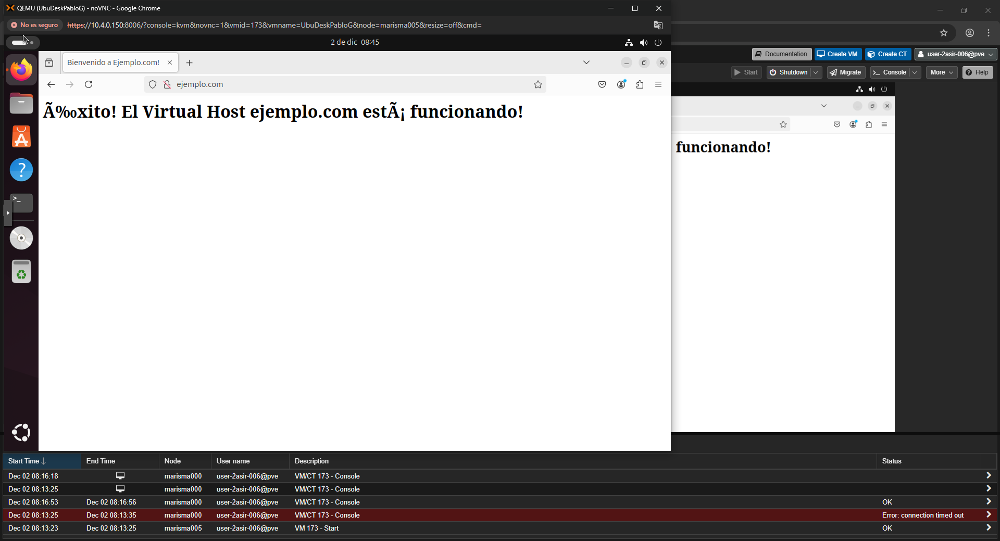


