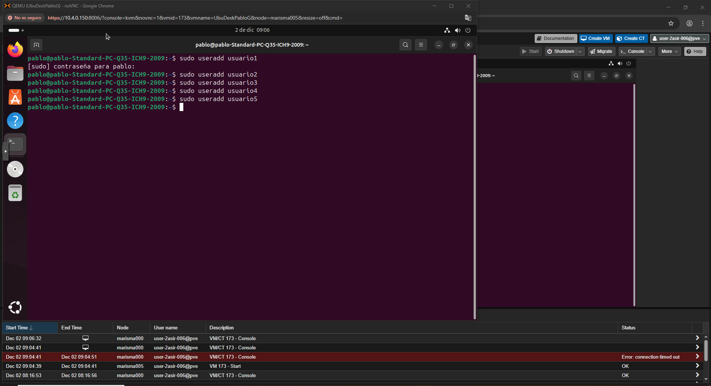
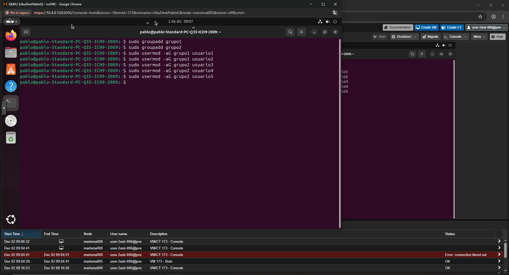
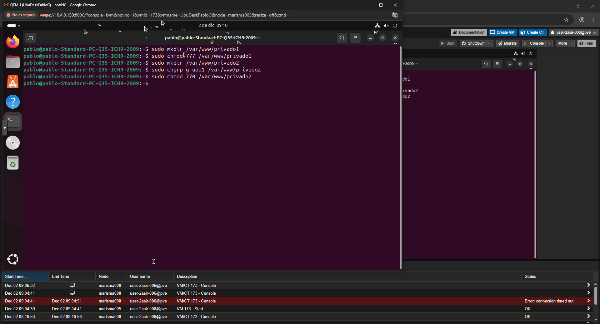
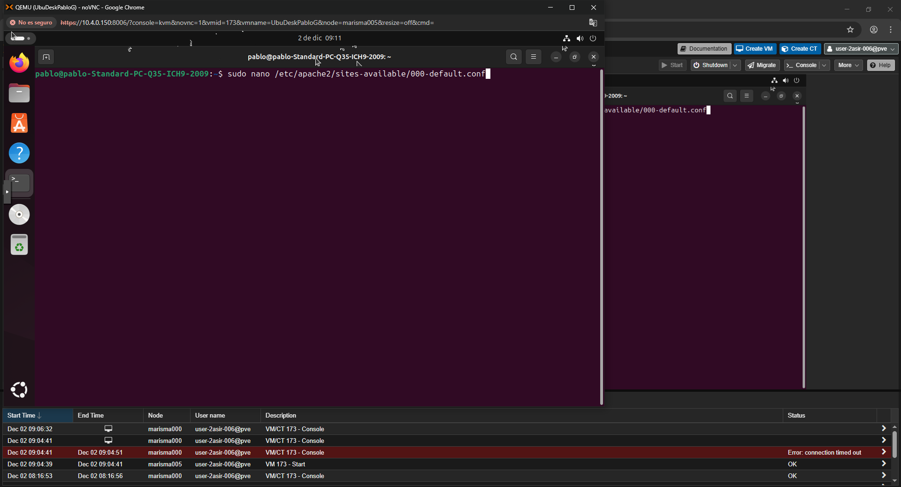
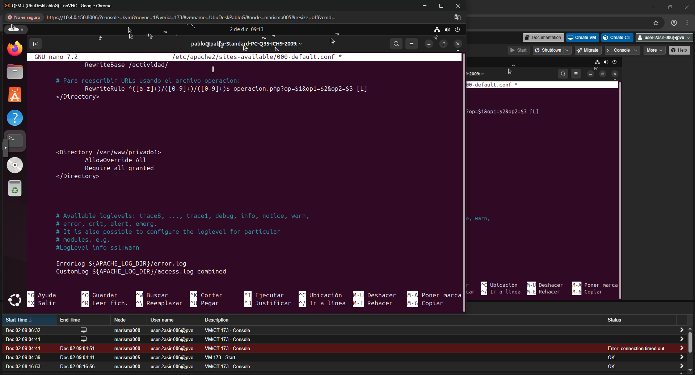
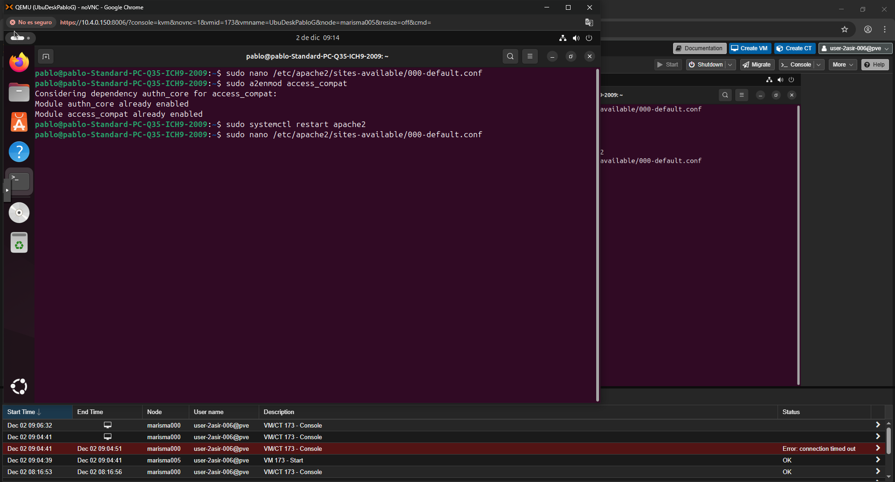
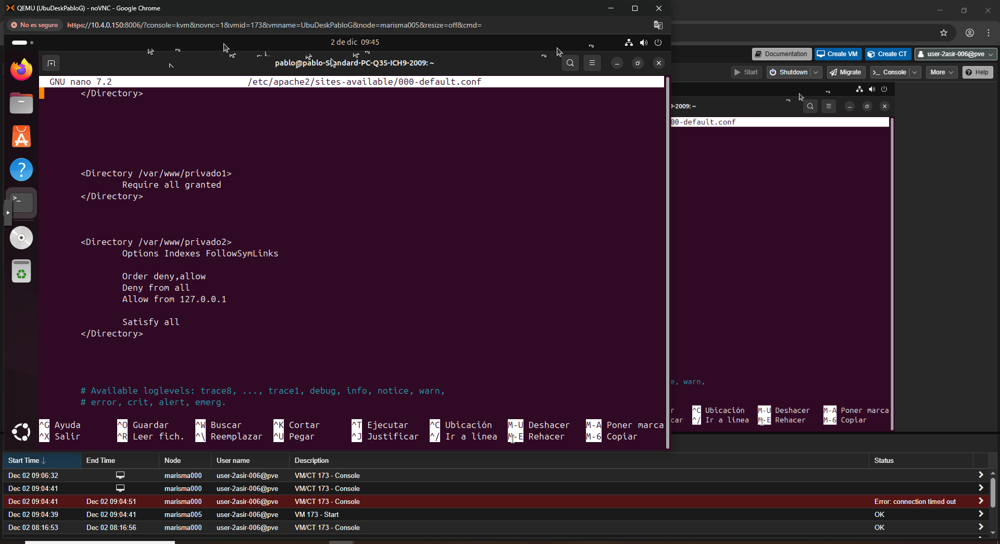

## 1. Crear los usuarios del sistema
sudo useradd usuario1  
sudo useradd usuario2  
sudo useradd usuario3  
sudo useradd usuario4  
sudo useradd usuario5  

## 2. Crear los grupos y añadir los usuarios
sudo groupadd grupo1
sudo groupadd grupo2

sudo usermod -aG grupo1 usuario1
sudo usermod -aG grupo1 usuario2

sudo usermod -aG grupo2 usuario3
sudo usermod -aG grupo2 usuario4
sudo usermod -aG grupo2 usuario5

## 3. Crear directorio privado1 (acceso a todos) y privado2 (acceso sólo grupo1)
sudo mkdir /var/www/privado1
sudo chmod 777 /var/www/privado1

sudo mkdir /var/www/privado2
sudo chgrp grupo1 /var/www/privado2
sudo chmod 770 /var/www/privado2
sudo usermod -aG grupo1 www-data   # Apache debe poder leerlo

## 4. Configurar Apache (editar 000-default.conf)
sudo nano /etc/apache2/sites-available/000-default.conf

## Añadir dentro del bloque <VirtualHost *:80>:

 <Directory /var/www/privado1>
    Require all granted
</Directory>

 <Directory /var/www/privado2>
 
    Options Indexes FollowSymLinks
    AllowOverride None

     Order deny,allow
     Deny from all
     Allow from 127.0.0.1

     Cambiar entre:
     Satisfy all
    Satisfy any
     Satisfy all
 </Directory>
 

Siempre que hagamos una modificación en la configuración de Apache debemos de reiniciar Apache:
**sudo systemctl restart apache2**
