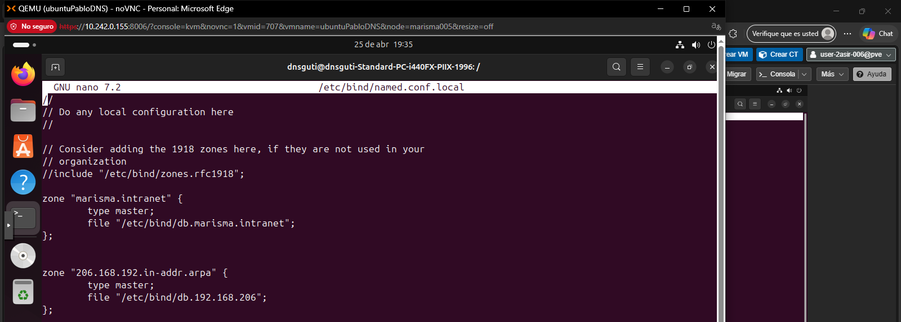
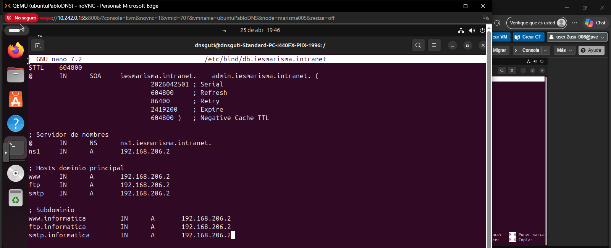
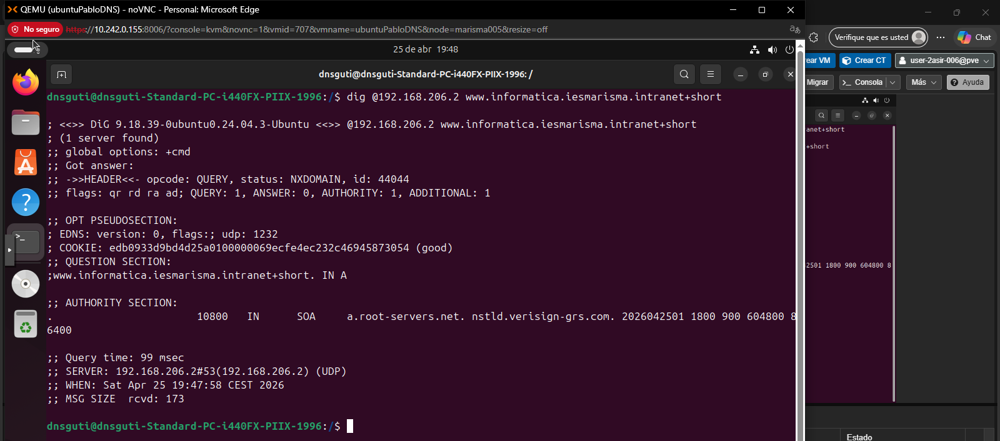

# Configuración de Subdominios en BIND9

Este documento detalla el procedimiento realizado para configurar el subdominio `informatica.iesmarisma.intranet` sobre una infraestructura DNS previa.

## 1. Declaración de la Zona Principal
En el archivo de configuración local, se asegura la existencia de la zona para el dominio base.

* **Archivo:** `/etc/bind/named.conf.local`  

## 2. Configuración del Archivo de Zona (Subdominio Virtual)
Se utiliza el método de subdominio virtual para integrar los nuevos registros en el fichero del dominio principal.

* **Archivo:** `/etc/bind/db.iesmarisma.intranet`
* [cite_start]**Acción:** Añadir registros tipo `A` para los hosts del dominio principal (`www`, `ftp`, `smtp`) y para los hosts del subdominio (`www.informatica`, `ftp.informatica`, `smtp.informatica`) vinculándolos a la IP del servidor.  

## 3. Aplicación de Cambios y Reinicio
Para que la nueva configuración surta efecto, es necesario reiniciar el servicio DNS.

* **Comando:** `sudo systemctl restart bind9`

## 4. Verificación de Resolución
Se comprueba que el servidor responde correctamente a las consultas del subdominio.

