# Memoria de Configuración: Servidor marisma.local

## 0. Instalar todo lo que necesitamos

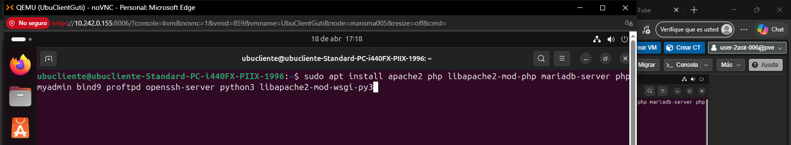
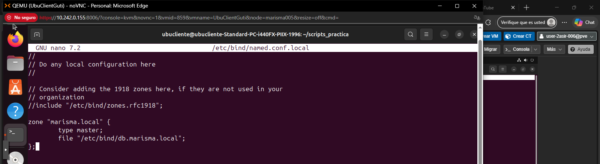

## 1. Copiar base de datos de Bind9

sudo apt update  
sudo apt purge -y bind9 bind9utils bind9-doc  
sudo rm -rf /etc/bind  
sudo rm -rf /var/cache/bind  
sudo apt install -y bind9 bind9utils  
sudo cp /etc/bind/db.local /etc/bind/db.marisma.local
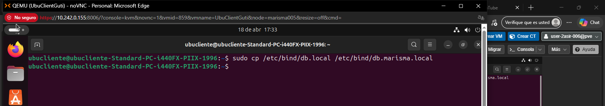

## 2. Configurar los archivos (crear_subdominio.sh, crear_vhost.sh y crear_db.sh) y otorgarle permisos

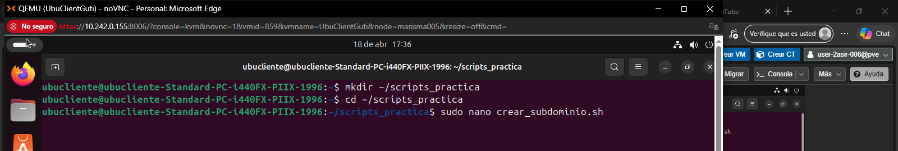

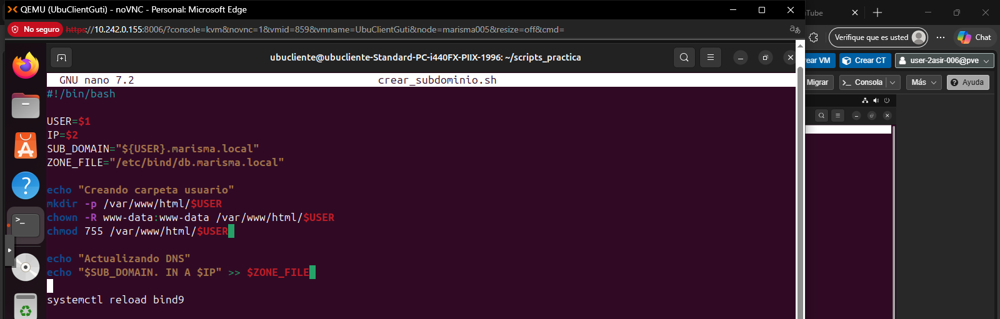
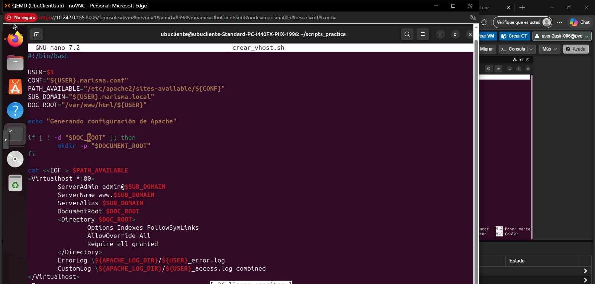
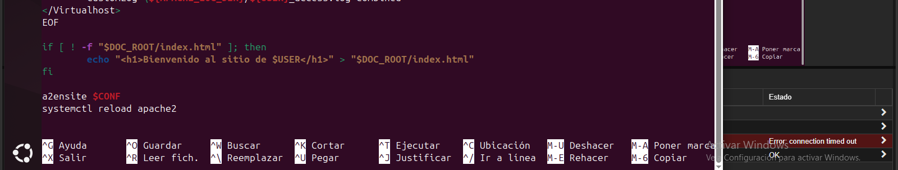
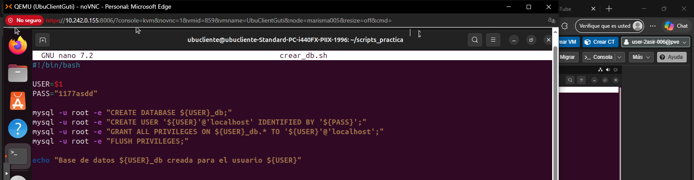
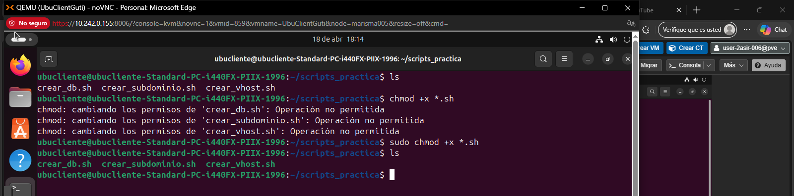

### Comprobación de que todo está activo y sin errores:
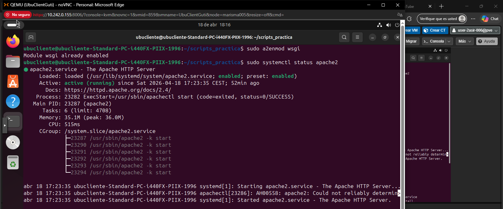
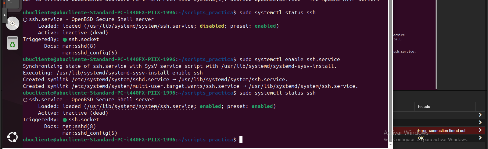

## 3. Crear usuario pablo con IP de la VM

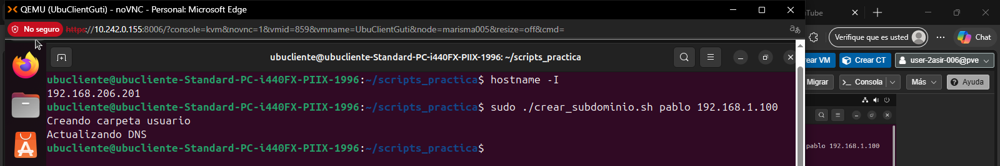

## 4. Crear base de datos para el usuario pablo

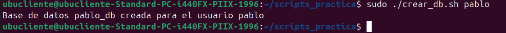

## 4. Generar la configuración de apache para pablo

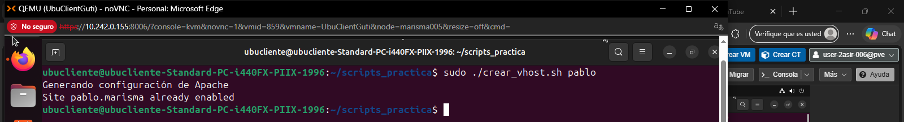

## 5. Comprobamos que nuestra VM conoce a marisma.local y habilitamos la configuración de phpmyadmin
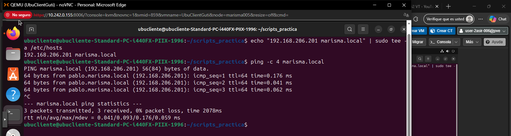

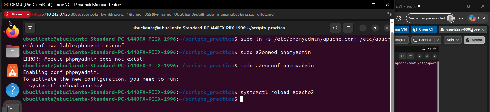

## 6. Instalar servidor FTP

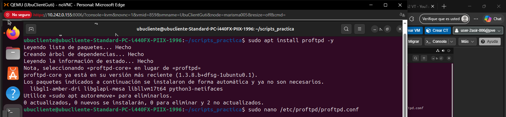

### Tenemos que quitar la # de 'Default Root -'
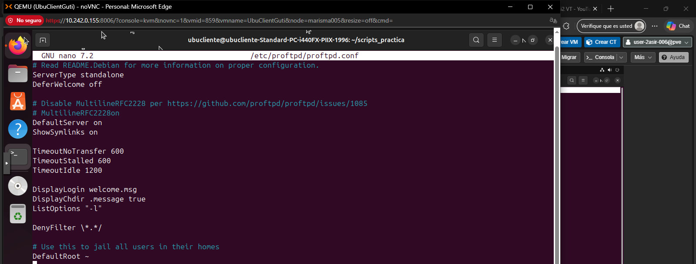

### También tenemos que configurar el archivo tls.conf con lo siguiente:
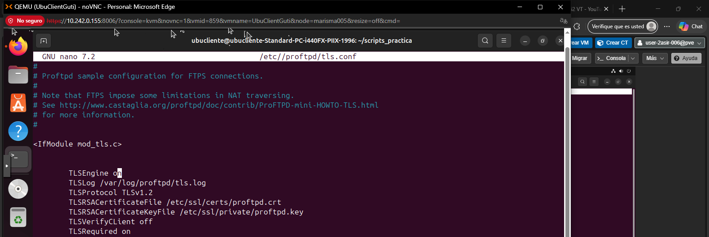

## 7. Añadir usuario y habilitar el módulo del servidor web de apache

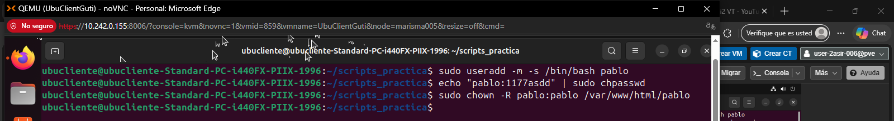

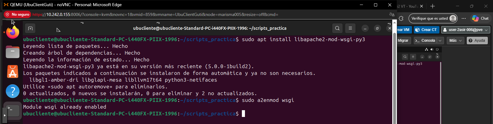

## 8. Comprobaciones de que todo funciona:

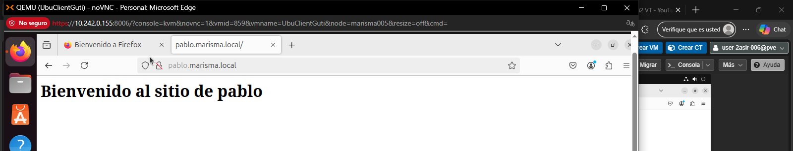

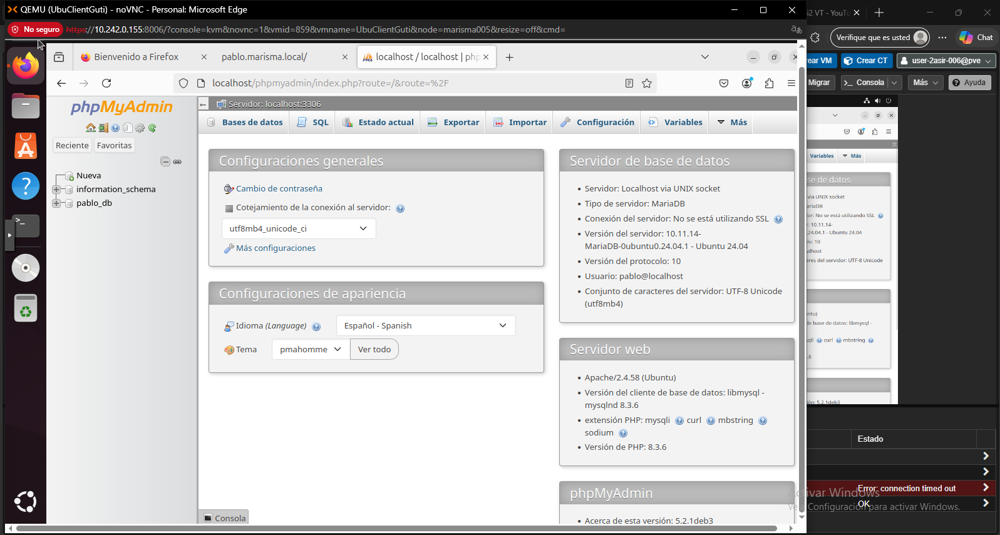

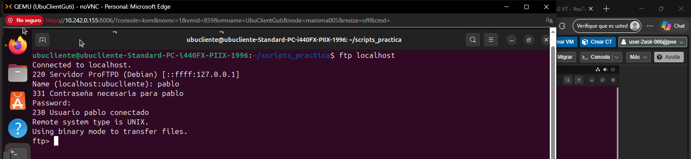
